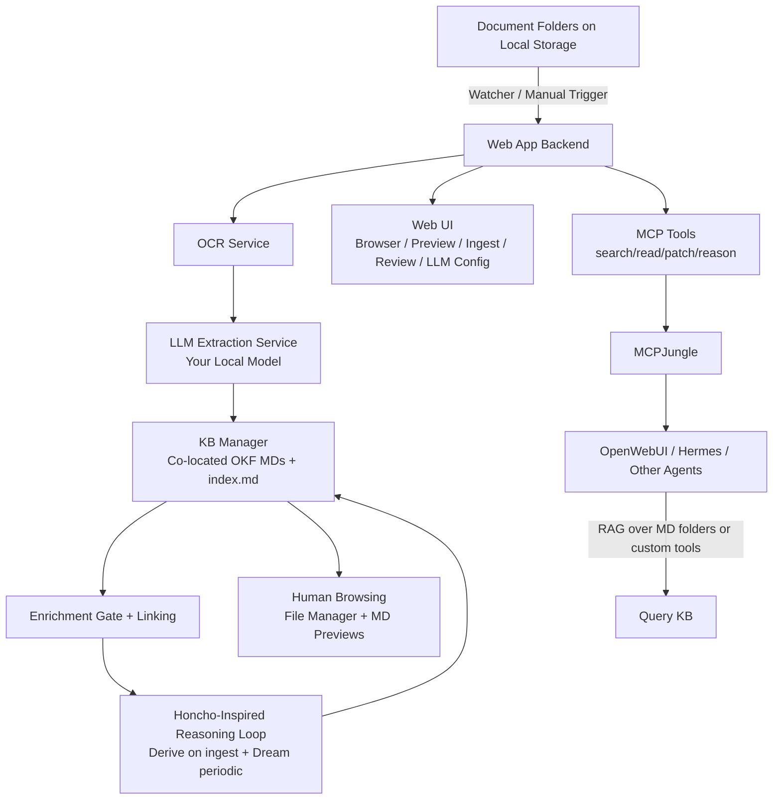

# smart-okf Development Plan

## Vision
A self-contained, local web app + backend that turns your sensitive document folders into a rich, co-located OKF knowledge base. Your local LLM handles OCR post-processing, structured fact extraction, and ongoing reasoning. MD files live next to originals for instant human browsing. Agents (OpenWebUI, Hermes, etc.) access via folders, API, or MCP. Honcho-inspired loop (store/ingest → derive/reason → dream/synthesize → query) runs locally with your models only.

**Key Constraints**
- Everything local and private (no external APIs unless you explicitly add).
- Co-located MDs in document folders (with `index.md` / companion files).
- Your LLM backend (Ollama/llama.cpp configurable; small dedicated model for efficiency).
- Low cognitive load (reliable, observable, reviewable outputs).

## Current State (Scaffolding)
- Project structure created.
- Basic README, pyproject.toml skeleton, Pydantic OKF models.
- Core prompts for extraction and reasoning (inspired by Honcho loop: explicit facts, deductive conclusions, inductive patterns, conflicts, links, actions).
- Services stubs for OCR, extraction, KB management, reasoning loop, LLM client.
- High-level architecture defined.

## Phased Roadmap

### Phase 0: Scaffolding & Foundations (Current — Complete this week)
- [x] Repo structure + README + DEVELOPMENT_PLAN.
- [x] `pyproject.toml` with dependencies (pydantic, pyyaml, watchdog, ollama or llama-cpp-python, pdfplumber/easyocr, fastapi/streamlit, etc.).
- [x] Core Pydantic models for OKF frontmatter and documents.
- [x] LLM client wrapper (Ollama Python client or llama-cpp; support local endpoints + small model config).
- [ ] Basic prompts in `/prompts/`:
  - `extraction_system.md`: Turn OCR/raw text into structured OKF facts + frontmatter.
  - `reasoning_derive.md`: Explicit statements + deductive conclusions from new/changed content.
  - `reasoning_dream.md`: Periodic synthesis (patterns, conflicts, relationships, higher abstractions, action suggestions). Emulate Honcho Deriver + Dreamer.
- [ ] Simple CLI or script for one-shot ingest on a test folder (co-located MD creation).
- [ ] Documentation: Example folder structure, sample MD output, config examples.

**Deliverable**: Runnable basic extraction that produces valid co-located OKF MD next to a test PDF/scan.

### Phase 1: Core Pipeline & Co-Location (1-2 weeks)
- Folder watcher service (watchdog) or manual "ingest folder" trigger.
- Full OCR pipeline: Detect file type → OCR (images/PDFs) → LLM refinement/extraction to OKF MD (companion or `_kb/` subdir for cleanliness).
- KB Manager: Read/write co-located MDs, generate/maintain `index.md` per folder (listings + descriptions for breadcrumbs), enforce enrichment (search before create new concept), bidirectional linking.
- Provenance: Strong `source` field + optional raw transcript storage (SQLite or sidecar file).
- Validation/linting: YAML frontmatter schema + basic link checker.
- Config: YAML/env for document roots, LLM endpoint/model (small vs main), OCR settings, output style (companion `.md` vs `_kb/` subdir).

**Honcho Loop Adaptation (Local LLM)**:
- **Store**: Ingest creates "event" (new/changed file + extracted MD).
- **Derive** (on ingest or batch): LLM extracts explicit facts + deductive conclusions → writes/updates MDs.
- **Dream** (scheduled or on-demand): Periodic pass over recent MDs/indices → inductive patterns, conflict detection (e.g., duplicate facts with diffs), relationship inference (new links), abstractions/summaries, action items. Persist as new Insight/Pattern MDs or updates to indices/log.md.
- **Query**: Simple search (ripgrep + LLM rerank) or full API. Later MCP tools.
- No Honcho dependency — pure local LLM calls + file-based state.

**Deliverable**: End-to-end ingest on real folder → co-located structured MDs appear → basic reasoning pass adds insights/links.

### Phase 2: Web App UI (2-3 weeks)
- Lightweight web interface (recommend **Streamlit** first for speed — Python-native, excellent for file browsers, previews, buttons, progress. Easy to Dockerize. Later migrate/refine to FastAPI + nice frontend if needed).
- Features:
  - Document tree browser (shows originals + co-located MDs).
  - Inline MD preview + simple editor (with OKF validation).
  - Ingest controls: Select paths, run OCR+extract, watch mode toggle.
  - LLM dashboard: Select/configure endpoint + model (small dedicated for pipeline, or your main models). Test prompts.
  - Reasoning controls: Trigger derive/dream passes (scoped to recent/changed), view logs/outputs.
  - Review queue: Low-confidence extractions, detected conflicts → human approve/edit.
  - Settings: Hierarchy templates, tag schemas, co-location style, backup hooks.
- Backend API (FastAPI if not pure Streamlit) for programmatic access.
- Observability: Job logs, confidence scores, provenance traces.

**Deliverable**: Usable local web app that makes the whole system feel like a polished internal tool.

### Phase 3: Agent Integration & Polish (2-4 weeks)
- MCP server/tools (librarian): `search`, `read`, `propose_write`/`patch` (with enrichment gate), `reason` (trigger dream), `maintain` (lint). Register in your MCPJungle.
- OpenWebUI integration:
  - Primary: Point OpenWebUI Knowledge Base / RAG at document root or MD folders (MDs are high-signal).
  - Advanced: Expose web app API or MCP tools as custom retriever/tool in OpenWebUI chats.
- Optional SQLite for raw full-text transcripts + fast search (MDs remain source of truth).
- Git integration: Auto-commit MD changes (optional, configurable).
- Performance: Batch processing, caching of indices, efficient search (ripgrep + embeddings if desired, but keep lightweight).
- Security: Localhost/LAN binding, optional simple auth or Tailscale mTLS.

**Deliverable**: Agents in OpenWebUI / Hermes etc. can intelligently query and even help maintain the KB. Full loop operational.

### Phase 4: Advanced Features & Hardening (Ongoing)
- Graph visualization of links/indices (simple in UI or separate).
- Conflict resolution workflows + versioning (OKF log.md or git).
- Multi-user or shared bundles? (later, if needed).
- Better OCR/layout preservation (marker-pdf, vision models).
- Prompt iteration / few-shot examples based on your real documents.
- Evaluation harness (sample queries + expected retrieval quality).
- Deployment: Refined Docker Compose (app + optional small Ollama/llama.cpp sidecar), systemd units, Proxmox LXC template.
- Backup/restore aligned with your 3-2-1.
- Mobile-friendly or TUI alternative for quick checks?

## Architecture Overview (Mermaid)

**Data Flow**:
1. New/changed doc in watched folder.
2. OCR → LLM extracts structured facts → writes co-located `.md` (or `_kb/`).
3. Enrichment: Search existing KB first.
4. Reasoning: Derive immediate insights; Dream later for patterns/conflicts/links/actions.
5. Humans browse folders directly.
6. Agents query via folders (RAG), API, or MCP.

## Risks & Mitigations
- **OCR/Extraction Quality**: LLM refinement step + confidence scores + review queue. Start with high-quality tools (marker + vision LLM).
- **Junk Drawer / Drift**: Strict enrichment gate + linting + Honcho-style consolidation in Dream phase.
- **Performance on modest hardware**: Small dedicated LLM for pipeline; batching; scope reasoning to recent changes.
- **Cognitive Load (ADHD-friendly)**: Reliable automation, clear logs, one-click triggers, review queue instead of silent failures.
- **Maintenance**: Automated lint/maintain tools; git for MDs.

## Success Metrics
- Co-located MDs provide immediate value when browsing folders (key facts/dates visible without opening originals).
- Agents retrieve precise, linked, provenance-backed info with minimal hallucination.
- Reasoning loop produces useful abstractions, detects real conflicts, suggests actionable links.
- Low ongoing maintenance; system compounds knowledge over time.

## Next Immediate Actions
1. Complete Phase 0 scaffolding files (pyproject, models, prompts, basic extraction script).
2. Test on a small real document set (e.g., one genealogy folder or IT notes).
3. Iterate prompts based on output quality.
4. Move to Phase 1 watcher + full co-location logic.
5. Build Streamlit UI skeleton.

Document decisions and prompt iterations in `/docs/` or your Notion KB.

This plan is living — update as we build. Feedback on priorities or specific doc types welcome.
