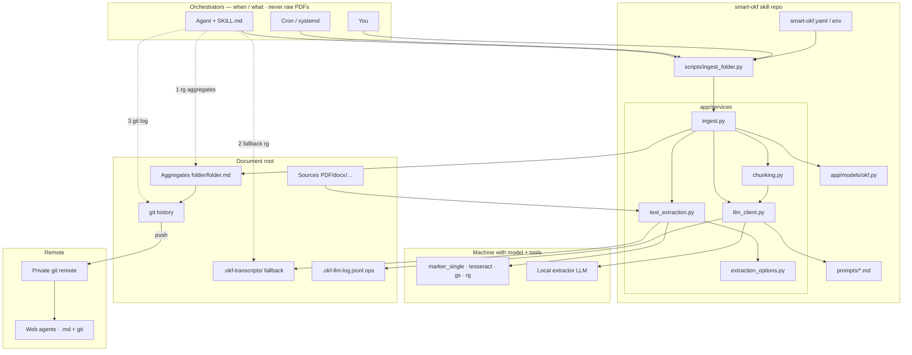

# smart-okf

[](https://github.com/TuxLux40/smart-okf/actions/workflows/python.yml)
[](LICENSE)
[](pyproject.toml)
[](docs/OKF_SPEC.md)

**Local-first [OKF](https://github.com/GoogleCloudPlatform/knowledge-catalog/blob/main/okf/SPEC.md) knowledge base** for sensitive personal documents. Point it at a folder tree — health, insurance, government mail, provider contracts — and a local LLM turns each folder into one greppable Markdown aggregate. Originals never leave your machine and never move into a proprietary DB.

**The point of this repo is not “OCR for its own sake.”** It is that **agents retrieve correctly**: whole-tree search, distilled facts first, raw text as fallback, git for time and matter-linking — not “open the finances folder and hope.” That retrieval contract lives in [`SKILL.md`](SKILL.md) and is mandatory for any agent using this skill.

Ships as a [Claude Code agent skill](SKILL.md): no server, no daemon, no webapp. Web agents without your NAS consume finished Markdown via a [private git remote](#remote-access-via-git).

---

## Contents

- [Core concepts](#core-concepts)
  - [Why this exists: the retrieval ladder](#why-this-exists-the-retrieval-ladder)
  - [OKF in one paragraph](#okf-in-one-paragraph)
  - [Orchestrator vs extractor](#orchestrator-vs-extractor)
  - [Git vs Markdown](#git-vs-markdown)
  - [Why a script (not pure agent inference)](#why-a-script-not-pure-agent-inference)
- [Architecture](#architecture)
  - [Component flow](#component-flow)
  - [How retrieval works (implemented)](#how-retrieval-works-implemented)
  - [What this is not](#what-this-is-not)
- [Why not just use X?](#why-not-just-use-x)
- [Features](#features)
- [Prerequisites](#prerequisites)
- [Installation](#installation)
- [Quick start](#quick-start)
- [Change tracking](#change-tracking)
- [Remote access via git](#remote-access-via-git)
- [LLM call log (JSONL)](#llm-call-log-jsonl)
- [Configuration](#configuration)
- [OKF output format](#okf-output-format)
- [Development](#development)
- [Roadmap](#roadmap)
- [Core principles](#core-principles)

---

## Core concepts

### Why this exists: the retrieval ladder

Personal life does not fit one folder name. A benefits form, a utility dispute, or “help with finances” needs **IDs, dates, and amounts scattered across** `providers/`, `finances/`, `insurances/`, `apartments/`, lawyers, etc. If an agent only opens the topically named folder, it fails — that failure mode is why smart-okf exists.

**Agents must follow this ladder** (also in [`SKILL.md`](SKILL.md) — do not skip steps):

| Step | Layer | Path / tool | Use for |
|------|--------|-------------|---------|
| 1 | **Aggregates** | `**/*.md` with `type: FolderSummary` | Distilled facts, tags, orientation summary, provenance |
| 2 | **Transcripts (fallback)** | `.okf-transcripts/<relpath>.txt` | Exact wording, full reference numbers, quotes when the MD is thin or incomplete |
| 3 | **Git history** | `git log`, `--grep`, `-S` | What’s new, same-batch uploads, same matter months later via IDs in messages |
| 4 | **JSONL** | `.okf-llm-log.jsonl` | Ingest debugging **only** — never answers about the user’s documents |

Rules that are non-negotiable:

- Search the **entire document root** with `rg`, never only one topical folder.
- Prefer aggregates first; **if the answer needs a full ID, amount, or verbatim clause, fall back to transcripts** (hidden folder, still greppable) — do not re-OCR and do not invent.
- Put **stable unique identifiers** into both MD bodies (extraction) and **commit messages** after ingest so matters link across folders and months.
- Cite **source filenames** (`_Source: …_`), not only the aggregate path.

Without that ladder written into the skill, agents will not invent it reliably. Encoding it is the product.

### OKF in one paragraph

[Open Knowledge Format](https://github.com/GoogleCloudPlatform/knowledge-catalog/blob/main/okf/SPEC.md) is Google’s idea of knowledge as **plain Markdown + YAML frontmatter** — concepts you can `cat`, `rg`, and git — not a closed database. You were already heading the same direction (LLM transcripts + structured notes agents can search). smart-okf adopts OKF’s shape and adds a practical layout for personal archives: **one aggregate concept per folder** (not one `.md` per PDF), provenance fields, hash-incremental re-ingest, and the retrieval ladder above. Spec details: [`docs/OKF_SPEC.md`](docs/OKF_SPEC.md).

### Orchestrator vs extractor

| Role | Who | Job | Sees raw PDFs? |
|------|-----|-----|----------------|
| **Orchestrator** | Claude Code, Hermes, OpenWebUI automation, cron, you | When to ingest; how to **retrieve** and answer (`SKILL.md` + `rg` + git) | **No** |
| **Extractor** | Local model (`SMART_OKF_LLM_HOST` / `MODEL`) | Structure text → OKF **inside** `scripts/ingest_folder.py` | **Yes**, only on your machine |

There is no mode where the chat agent *is* the extractor. The script is a subprocess. That keeps raw document text off cloud orchestrators and makes cron behave like interactive runs.

### Git vs Markdown

| Layer | Holds | Does not hold |
|-------|--------|----------------|
| **Aggregates (HEAD)** | Current distilled truth | A changelog of every ingest |
| **Git history** | When knowledge appeared/changed; batch co-arrival; ID-tagged commits | The only place for current facts (those live in MD) |

**Two birds:** (1) one commit after a batch upload correlates co-arrival across folders; (2) **IDs in the commit message** (Aktenzeichen, contract #, …) make the same matter greppable months later. Case-event dates from the documents still belong **in the MD body** as facts. Root “one matter” files (roadmap R2) only when IDs + batches still aren’t enough.

### Why a script (not pure agent inference)

| Need | Pure agent on PDFs | Script |
|------|-------------------|--------|
| Privacy of raw docs | Bytes enter cloud context | Extractor stays local |
| Unattended re-ingest | No agent online | Cron runs the same CLI |
| Incremental skip | Easy to re-do everything | `source_hashes` |
| OCR / marker / transcripts / heading rules | Re-prompt fragile | Implemented once |
| Same result for every orchestrator | Each agent reinvents | One contract |

The skill teaches **retrieval + when to run the engine**. The script *is* the engine.

---

## Architecture

### Component flow



**Install tools** (`uv`, CLIs, LLM server) on the machine that runs ingest — not necessarily on a NAS that only stores documents.

### How retrieval works (implemented)

This is the retrieval system. It is intentional and complete for the current product:

| Mechanism | Role |
|-----------|------|
| **ripgrep** over aggregates | Primary full-text search of distilled knowledge |
| **Read aggregates** | Orientation summary + per-source sections + frontmatter |
| **ripgrep over `.okf-transcripts/`** | **Mandatory fallback** when MD is thin (full IDs, quotes) |
| **git log / grep / pickaxe (`-S`)** | Time, batches, ID-linked history |
| **Provenance lines** | Cite real filenames |
| **Whole-tree search** | Cross-folder blindness prevention |

There is **no separate search daemon**. Q&A does not call the extractor LLM. Ingest writes the layers; the skill tells agents how to walk them.

### What this is not

These are **common industry approaches to large-corpus search**, not missing checklist items you “forgot,” and **not** on the committed roadmap unless you later hit scale pain:

| Approach | What it is | Why not default here |
|----------|------------|----------------------|
| Vector / embedding RAG | Chunk → embed → nearest-neighbor | Privacy, infra, weaker exact-ID match than `rg` on structured MD |
| BM25 / search engine service | Ranked full-text server | Extra process; plain `rg` + good extraction is enough for personal archives |
| Graph DB of entities | Explicit matter graph | R2-style MD/git is lighter for this use case |
| Query rewriter / multi-hop agent framework | Extra model loops | The ladder *is* the multi-hop procedure |

If folders grow huge and `rg` alone feels weak, *then* evaluate BM25 or hybrid search — as an optional upgrade, not a prerequisite for usefulness.

---

## Why not just use X?

| Alternative | Good fit if… | Gap |
|-------------|----------------|-----|
| **[Paperless-ngx](https://docs.paperless-ngx.com/)** | Mature OCR + search + correspondents | Docs live in its DB; no LLM-distilled greppable OKF facts next to files |
| **OpenWebUI RAG** | Chat with PDFs, zero structure | No portable structured facts, weak provenance, no agent retrieval contract |

smart-okf’s differentiator: **structured facts in plain Markdown beside originals** + **explicit agent retrieval ladder** + **git as timeline** — no required cloud, no required DB.

---

## Features

| Capability | Status |
|------------|--------|
| One aggregate OKF `.md` per folder, non-recursive | ✅ |
| PDF, txt, docx, eml, csv, xlsx, images | ✅ |
| marker PDF backend (external CLI; `--no-marker` → pdfplumber + OCRmyPDF) | ✅ Default on |
| Raw transcripts `.okf-transcripts/` (lossless + **query fallback**) | ✅ |
| Hash-incremental re-ingest (`source_hashes`) | ✅ |
| Orientation summary + optional mermaid timeline | ✅ |
| Chunking oversized text (character budget) | ✅ |
| Optional vision model for handwriting + scene | ✅ Opt-in |
| Agent skill with **mandatory retrieval ladder** | ✅ |
| Git timeline + ID-bearing commits | ✅ Convention |
| Private git remote for web agents | ✅ Decision (R1) |
| JSONL LLM call log (ops, not knowledge) | ✅ |
| Cross-folder auto “matter” files | ⏳ R2 if needed |
| Vector RAG / BM25 service | ❌ Not planned as default — see [What this is not](#what-this-is-not) |

---

## Prerequisites

| Tool | Purpose |
|------|---------|
| [uv](https://docs.astral.sh/uv/) | Python env |
| OpenAI-compatible LLM server | Extraction (LM Studio, llama.cpp, Ollama, vLLM) |
| [ripgrep](https://github.com/BurntSushi/ripgrep) (`rg`) | **Query** |
| `tesseract`, `ghostscript` | Image OCR / OCRmyPDF path |
| [marker](https://github.com/datalab-to/marker) `marker_single` | Default PDF path — **external** install (`pipx install marker-pdf`), not a pip dep of this repo |

marker: GPL-3.0 + modified OpenRAIL-M weights; free for personal/research use; commercial redistribution may need a [datalab.to](https://www.datalab.to/pricing) license. Opt out with `--no-marker`.

First run: ask your agent to follow [Onboarding](SKILL.md#onboarding-first-run).

---

## Installation

```bash
git clone https://github.com/TuxLux40/smart-okf.git
cd smart-okf
uv sync --group dev
ln -s "$(pwd)" ~/.claude/skills/smart-okf   # Claude Code skill
```

---

## Quick start

### 1. Ingest

```bash
uv run python scripts/ingest_folder.py /path/to/your/documents \
  --host http://127.0.0.1:1234 --model <your-model>
```

```
documents/
├── documents.md      ← aggregate of files in this folder only
├── contract.pdf
└── genealogy/
    ├── genealogy.md  ← separate aggregate
    └── birth.pdf
```

### 2. Re-run when files change

```bash
uv run python scripts/ingest_folder.py /path/to/your/documents
# or, with smart-okf.yaml:
uv run python scripts/ingest_folder.py
```

Incremental: unchanged SHA-256 → no LLM call.

```cron
0 3 * * 0  cd /path/to/smart-okf && uv run python scripts/ingest_folder.py
```

### 3. Query via the skill

Ask the agent a real question. It **must** use the [retrieval ladder](#why-this-exists-the-retrieval-ladder): whole-tree `rg` on aggregates → transcripts if thin → git for history/IDs. Not “open one folder and guess.”

---

## Change tracking

After each ingest, commit the document root. **Commit messages must include stable IDs** from new/changed sections:

```bash
git add -A
git commit -m "Ingest 2026-07-18: EON 407631050, Rheinpower; providers+finances"
git log --grep='407631050' -i
git log -S '407631050' -- '*.md'
```

See [Git vs Markdown](#git-vs-markdown). Bad OCR/summary → `git revert`, not silent loss.

---

## Remote access via git

**R1 decided:** private git remote (Gitea / Forgejo / GitLab self-hosted, ideally Tailscale) of aggregates — not a smart-okf API server, not re-OCR in the browser.

1. Ingest locally  
2. Commit (with IDs)  
3. Push (often **Markdown-only**; keep PDFs on NAS)  
4. Web agents clone/pull or use a host connector  

Gitea is a **git remote**, not an MCP server. Optional MCP can wrap a *clone*; git stays source of truth.

---

## LLM call log (JSONL)

`<documents>/.okf-llm-log.jsonl` — model, duration, retries, success. **Ops only.** Usually gitignored. Not part of the retrieval ladder for user questions.

```bash
rg '"success": false' /path/to/documents/.okf-llm-log.jsonl
```

---

## Configuration

Load order: field defaults → `smart-okf.yaml` → `SMART_OKF_*` env. See [`smart-okf.example.yaml`](smart-okf.example.yaml) and [onboarding](SKILL.md#onboarding-first-run).

| Variable | Default | Role |
|----------|---------|------|
| `SMART_OKF_LLM_HOST` | `http://localhost:11434` | Extractor endpoint |
| `SMART_OKF_LLM_MODEL` | `qwen2.5:3b` | Extractor model |
| `SMART_OKF_LLM_API_KEY` | `not-needed` | If required |
| `SMART_OKF_VISION_MODEL` | unset | Optional vision for images |
| `SMART_OKF_CONFIG` | `smart-okf.yaml` | Config path |

Remote non-allowlisted hosts need `allow_remote_llm`. Suffixes: [`app/constants.py`](app/constants.py).

---

## OKF output format

```yaml
---
type: FolderSummary
title: Contracts
description: Aggregated extraction of 2 document(s) in contracts/2024
tags: [legal, contract]
sources:
  - contracts/2024/lease.pdf
  - contracts/2024/isp.pdf
source_hashes:
  lease.pdf: 4a1f...
  isp.pdf: 9c02...
---

Orientation summary…

## Lease

_Source: lease.pdf_

…

## Isp

_Source: isp.pdf_

…
```

Code: [`app/models/okf.py`](app/models/okf.py). Conventions: [`docs/OKF_SPEC.md`](docs/OKF_SPEC.md).

---

## Development

```bash
uv sync --group dev
uv run ruff check --fix . && uv run ruff format .
uv run mypy app scripts tests
uv run pytest -q
```

```
app/
├── config.py
├── models/okf.py
└── services/          # ingest, llm_client, text_extraction, chunking, …
SKILL.md               # onboarding · ingest · **retrieval ladder**
scripts/ingest_folder.py
docs/OKF_SPEC.md
docs/DESIGN.md
docs/HANDOFF_FOR_CLAUDE.md
```

---

## Roadmap

- **R1** — Private git remote: **decided** (ops examples only)
- **R2** — Cross-folder matter files when IDs + git batches aren’t enough
- **R3** — Extraction verbosity valve  
- **R4** — Semantic near-duplicates  
- **R5** — Cron install/list/remove helpers  
- **R6** — Docling as optional backend (evaluated, not adopted)

History and cut scope: [`docs/DESIGN.md`](docs/DESIGN.md).

---

## Core principles

1. **Retrieval ladder is the product** — agents must be told explicitly; whole tree → aggregates → **transcripts as fallback** → git; never JSONL for answers.  
2. **Privacy & local extraction** — raw PDFs stay off cloud orchestrators.  
3. **Files stay yours** — no proprietary document DB.  
4. **Git = timeline; MD = current truth** — IDs in bodies and commit messages.  
5. **OKF native** — portable Markdown + frontmatter.  
6. **Script = extractor; skill = retrieval + control plane.**  
7. **Bring your own local LLM** for extraction.

---

## Related

Inspired by understory (Codacus), Karpathy-style LLM wikis, and Google’s [OKF](https://github.com/GoogleCloudPlatform/knowledge-catalog/tree/main/okf). Format: [`docs/OKF_SPEC.md`](docs/OKF_SPEC.md).

## License

[MIT](LICENSE)
