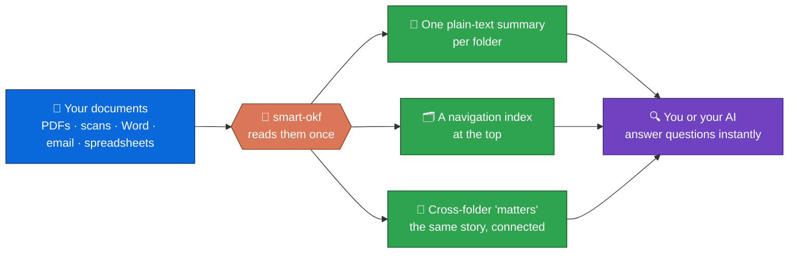
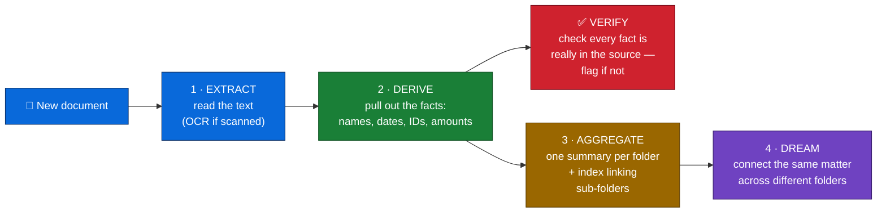
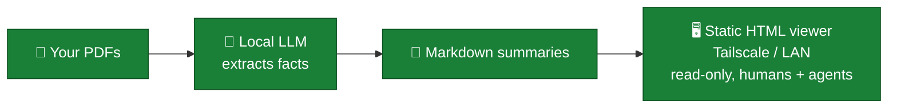
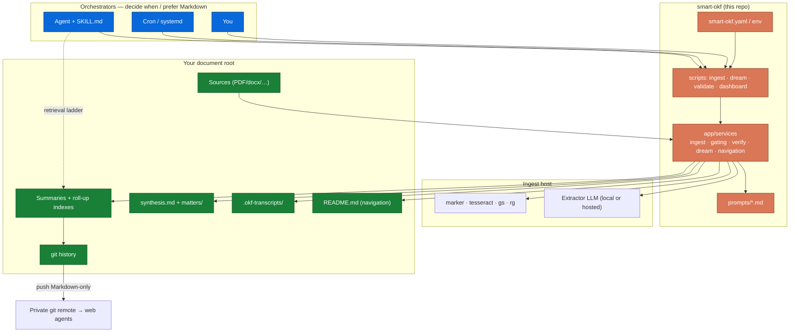

## 🧩 The problem & the solution

You have folders full of documents — insurance letters, doctor's reports, contracts, tax forms, government mail and more. Suppose you have a dispute with a utility provider: you need many different information like move-in date, meter reader and bank statements to prove payments. Depending on the topic and the amount of files, compiling these facts by hand can take a *very* long time. Sure, you can ask an AI assistant, but it re-reads the same scanned files from scratch every single time — slowly, and often getting numbers wrong as the context grows. Not to mention how fast you'll burn through tokens.

**This is where the smart-okf skill comes in. It pre-reads each document once** and writes a short, structured summary in plain Markdown and adherence to the OKF-standard _right next to your files_. This enables agents to gather these facts quickly and reliably and answer any question the summary in an instant — no re-scanning, no guessing. Your documents never move, never get renamed, and (by default) never leave your machine.

Think of it as a **librarian for your filing cabinet**: it doesn't reorganize your drawers, it writes an index card for every document and a finding-aid for every drawer — then keeps noticing when the same matter shows up in three different drawers.

Basically what this is supposed to achieve is automating the creation of a knowledge base from *private* documents and make the wiki self-evolve, so that retrieval of crucial information is standardized, more accessible and trustworthy.

---

## 🎯 Core principles

1. **Library + librarian** — folder summaries are the library of facts; synthesis is the librarian that connects them.
2. **The retrieval ladder** — whole tree → summaries → transcripts → git
3. **Compile once, then reason** — extraction is the floor, not the ceiling.
4. **Your files stay yours** — portable Markdown, no proprietary database.
5. **Correct facts above all** — every extraction is verified; doubtful ones are flagged, never silently trusted.
6. **Bring your own LLM** — any OpenAI-compatible server.

---

## ✨ The workflow visualized



After a run, your document folder looks like this with **knowledge added alongside**:

```text
documents/
├── README.md                 ← 🆕 auto-generated navigation & stats (for humans)
├── synthesis.md              ← the "big picture" across every folder
├── matters/                  ← one file per cross-folder matter (e.g. an ongoing dispute)
├── insurance/
│   ├── insurance.md          ← 📝 summary of everything in this folder
│   ├── policy.pdf            ← original doc, unchanged
│   └── claim-letter.pdf      ← original doc, unchanged
├── health/
│   ├── health.md             ← 🗂️ index linking down to sub-folders
│   ├── hospitals/
│   │   └── hospitals.md      ← 📝 summary of everything in this folder
│   └── neurology/
│       └── neurology.md      ← 📝 summary of everything in this folder
└── .okf-transcripts/         ← hidden: full raw text as fallback in case extraction missed something
```

---

## 🚀 Quick start

**1. Install** — one command, like any other [agent skill](https://github.com/vercel-labs/skills):

```bash
npx skills add TuxLux40/smart-okf
```

**2. Interview** — ask your agent _"set up smart-okf for my documents"_. It walks you through the rest in [`SKILL.md`](SKILL.md#onboarding-first-run): `uv sync`, which local LLM host/model to use, privacy level, and a test ingest on one small sub-folder first.

**3. Ask questions** — through your AI assistant, or just with a text search:

```bash
rg -i "policy number" /path/to/your/documents   # instant, reads the summaries
```

**4. Connect the dots** across folders (optional, run occasionally) — the agent can trigger this, or run it yourself:

```bash
uv run python scripts/dream.py /path/to/your/documents   # writes synthesis.md + matters/
```

<details>
<summary>Prefer manual install / no agent available?</summary>

Needs [uv](https://docs.astral.sh/uv/) and any local LLM server such as [LM Studio](https://lmstudio.ai/), [Ollama](https://ollama.com/), or [llama.cpp](https://github.com/ggml-org/llama.cpp):

```bash
git clone https://github.com/TuxLux40/smart-okf.git
cd smart-okf
uv sync --group dev
ln -s "$(pwd)" ~/.claude/skills/smart-okf   # so Claude Code can use it as a skill
```

Then point it at a folder (start with one small sub-folder as a test):

```bash
uv run python scripts/ingest_folder.py /path/to/your/documents \
  --host http://127.0.0.1:1234 --model <your-model>
```

</details>

---

## 🔬 How it works — four simple passes

Every document flows through the same pipeline. Each step is optional to _understand_, but the result is a document you can trust:



| Pass                     | Plain meaning                                                                                                                     | You get                                                                |
| ------------------------ | --------------------------------------------------------------------------------------------------------------------------------- | ---------------------------------------------------------------------- |
| **1 · Extract**   | Read the text out of the file (OCR for scans, layout-aware for PDFs)                                                              | A lossless transcript                                                  |
| **2 · Derive**    | Distil the durable facts — contract numbers, dates, contacts, amounts etc.                                                       | Facts written into the folder summary                                  |
| **2.1 Verify**     | A model double-checks the extraction against the original; anything invented is**kept but flagged**, never silently trusted | Trustworthy facts (`_Verification: FLAGGED` marks the doubtful ones) |
| **3 · Aggregate** | One summary per folder, and a roll-up index so parent folders link down to children                                               | A browsable hierarchy                                                  |
| **4 · Dream**     | Notice when the*same* matter (a dispute, a claim) spans several folders and pull it into one file                               | `synthesis.md` + `matters/`                                        |

This mirrors real **archival science** — provenance (respect the folders as they are), pertinence (group by subject across folders), and the finding-aid principle (an index points down, it never duplicates). The full reasoning is in [`docs/ARCHIVAL_PRINCIPLES.md`](docs/ARCHIVAL_PRINCIPLES.md).

---

## 🕰️ Timeline through Git versioning

The skill creates a git repo at document root where the agents write updates to, so git becomes the timeline of when knowledge appeared. That means aggregates hold the current *distilled* truth; git holds *when* *it got there*.

The trick that makes this useful later: we write **stable IDs** (contract numbers, customer IDs etc.) in the commit message, not just a date:

```bash
# Good — greppable IDs + which folders were touched
git commit -m "Ingest 2026-07-18: ACME-Energy 123456789, TeleNet, InkassoCorp; providers+finances"

# Weak — no join key, useless for correlation months later
git commit -m "Ingest: 2026-07-18"
```

This pays off in two places:

- **Retrieval** (ladder rung 3) — once summaries and transcripts don't have the answer, `git log --grep`/`git log -S` finds exact IDs across the whole history, and `git log --stat` / `git diff HEAD~1` shows what changed in the last ingest.
- **Dreaming** — the automatic matter-grouping pass (`app/services/matter_grouping.py`) groups purely by shared numeric tokens found *in the aggregate text itself*; the code never calls git. But the commit-message convention exists *because* that automatic match can miss a matter (same case, different wording, no shared 5+ digit token) — a batch upload landing in one commit still correlates co-arrival, and the ID you wrote into a commit message resurfaces months later via `git log --grep`, letting you (or the agent) tie the matter back together by hand even when the automatic pass never linked it.

See [`SKILL.md` — Change tracking](SKILL.md#change-tracking) for the full commit-message convention.

---

## 🔒 Privacy: you choose the level



- **Default:** a local or LAN model does the reading. Your raw documents never enter a cloud chat.
- **Optional:** point it at a hosted model if you prefer (only with `allow_remote_llm` — an informed, explicit choice).
- **Your files stay yours:** no proprietary database, no lock-in — just Markdown you can read, grep, and back up. smart-okf **never moves, renames, or deletes** your originals.
- **Read-only viewer:** a self-contained, static HTML file (no server, no daemon) — serve it over Tailscale or plain LAN (`python -m http.server`, Caddy, whatever) for a simple read-only interface humans and agents both can browse.

---

## 🖥️ The static HTML dashboard — read-only by construction

`uv run python scripts/dashboard.py /path/to/documents` writes a single self-contained `.okf-dashboard.html`: an MD browser, a `git log --graph` view, and a config summary, with inline CSS/JS and no CDN dependencies.

Read-only isn't a permission flag here — it's a property of what got built:

- **No server.** `render_dashboard()` returns one HTML string; the script writes it to disk and exits. Nothing ever listens on a socket, so there's no endpoint to send a write to.
- **No write code path.** The only JavaScript on the page is a client-side search filter over what's already rendered — no `fetch`, no `XMLHttpRequest`, no form that POSTs anywhere. Config is *displayed*, never *edited* from the page: there's no code that would take a change and write it back to `smart-okf.yaml` or the documents.
- **Regenerate, don't mutate.** Want it current? Re-run the script — it re-reads the tree and produces a new static file. There's no "save" button because there's nothing on the server side to save to.

That last point is also the boundary the project holds on purpose: a write path here is the line where this stops being a static dashboard and becomes the webapp smart-okf deliberately isn't (see [`app/services/ports.py`](app/services/ports.py) for the Protocols reserved for that, unimplemented).

---

## 🎁 Features at a glance

| Capability                                                                                                           | Status                                           |
| -------------------------------------------------------------------------------------------------------------------- | ------------------------------------------------ |
| One plain-Markdown summary per folder                                                                                | ✅                                               |
| Reads PDF, scans (OCR), Word, email, CSV, Excel, images                                                              | ✅                                               |
| Layout-aware PDF reading via[marker](https://github.com/datalab-to/marker) (optional, `--no-marker` to skip)        | ✅ Default on                                    |
| Full raw transcripts kept for exact quotes/IDs                                                                       | ✅                                               |
| Only re-reads files that actually changed                                                                            | ✅ Incremental                                   |
| **Mandatory fact-check** — every extraction verified against its source, doubtful ones flagged                | ✅ Always on                                     |
| **Roll-up hierarchy** — parent folders link down to children (`FolderIndex`)                                | ✅ Core                                          |
| **Self-updating `README.md`** with per-folder links + stats (great in Nextcloud)                             | ✅ Each run                                      |
| **Cross-folder synthesis** — `synthesis.md` + one file per matter                                           | ✅ Two-pass                                      |
| **Gating** — skip junk (manuals, terms); keep boilerplate out of deep analysis; skip password-protected files | ✅ Deterministic                                 |
| **Plausibility validator** + static **HTML dashboard** (no server)                                       | ✅                                               |
| Optional per-file facts, optional vision model for handwriting                                                       | ⚙️ Opt-in                                      |
| Git as a timeline of when knowledge appeared                                                                         | ✅ Convention                                    |
| Vector / embedding database                                                                                          | ❌ Not needed — see[below](#-why-not-just-use-x) |

---

## 📋 What you need

| Tool                                                         | Why                                                                                                |
| ------------------------------------------------------------ | -------------------------------------------------------------------------------------------------- |
| [uv](https://docs.astral.sh/uv/)                              | Runs the Python side                                                                               |
| An OpenAI-compatible LLM server                              | Does the reading —[LM Studio](https://lmstudio.ai/), [Ollama](https://ollama.com/), llama.cpp, vLLM |
| [ripgrep](https://github.com/BurntSushi/ripgrep) (`rg`)     | Fast searching                                                                                     |
| `tesseract`, `ghostscript`                               | OCR for scanned documents                                                                          |
| [marker](https://github.com/datalab-to/marker) _(optional)_ | Best-quality PDF reading — installed separately (`pipx install marker-pdf`)                     |

> ℹ️ **marker** is GPL-3.0 with model weights under a modified OpenRAIL-M licence (free for personal/research use). It's kept _outside_ this project's dependencies; pass `--no-marker` to use the built-in pdfplumber + OCR path instead.

---

## 🤔 Why not just use X?

| Alternative                                               | Great for                      | What smart-okf adds                                                                                     |
| --------------------------------------------------------- | ------------------------------ | ------------------------------------------------------------------------------------------------------- |
| **[Paperless-ngx](https://docs.paperless-ngx.com/)** | OCR, tagging, full-text search | LLM-distilled*facts* in portable Markdown next to your files — not locked in a database              |
| **RAG**                                             | Quick Q&A on a few docs        | Durable structured facts, provenance, and a retrieval contract an agent must follow — not one-off chat |
| **Vector / embedding search**                       | Fuzzy semantic search at scale | Exact ID/date matching with plain`rg`, no embedding infra, no privacy tradeoff                        |

smart-okf's niche: **an automated pipeline over your real folder tree + a retrieval method agents actually follow + git as a timeline**, all local-first. It doesn't claim to have invented Markdown notes — it makes them reliable for a life archive.

---

<details>
<summary>🛠️ Under the hood (for the curious)</summary>

### The retrieval ladder — how an agent finds an answer

Your life doesn't fit one folder name: a utility dispute touches `providers/`, `finances/`, `insurance/`, and `lawyers/`. So the skill makes agents search in a fixed order instead of opening one folder and hoping:

| Step | Look at                                              | For                                                                                                                             |
| ---- | ---------------------------------------------------- | ------------------------------------------------------------------------------------------------------------------------------- |
| 0    | **`synthesis.md`**                           | The big-picture map of cross-folder matters, conflicts, open actions                                                            |
| 0.5  | **`matters/*.md`**                           | A specific cross-folder case already resolved to its own file                                                                   |
| 0.8  | **`README.md` + roll-up indexes**            | Orient in an unfamiliar tree — which summary to read next (links, not facts)                                                   |
| 1    | **Folder summaries** (`type: FolderSummary`) | Distilled facts, tags, provenance —_start here for facts_. A `_Verification: FLAGGED` line = treat that fact as unverified |
| 2    | **Transcripts** (`.okf-transcripts/`)        | Exact wording, full IDs, quotes when a summary is thin                                                                          |
| 3    | **Git history**                                | What's new, same-batch uploads, the same matter months later via IDs in commit messages                                         |

Searching the **whole tree** and falling back to transcripts (never re-OCRing, never inventing) is the non-negotiable part — encoding that ladder into the skill _is_ the product.

### Orchestrator vs extractor

| Role                   | Who                                                                                  | Touches raw document bytes?                                  |
| ---------------------- | ------------------------------------------------------------------------------------ | ------------------------------------------------------------ |
| **Orchestrator** | Claude Code / Hermes / cron / you — decides*when* to ingest and _how_ to answer | Prefer**no** — answer from Markdown, transcripts, git |
| **Extractor**    | The local (or hosted) model called*inside* the ingest script                       | **Yes**, during ingest only                            |

The extractor always runs inside `scripts/ingest_folder.py`, so a scheduled cron run and an interactive run behave identically.

### Component flow



### What this deliberately is _not_

Not a vector database, not a BM25 search server, not a graph DB, not a multi-hop agent framework. For a personal archive, good extraction + `rg` + the retrieval ladder beats all of them on exact-ID matching, privacy, and simplicity. If a tree ever grows huge and plain search feels weak, _then_ a hybrid search backend is an optional upgrade — never a prerequisite.

### An example summary file (OKF format)

```yaml
---
type: FolderSummary
title: Contracts
description: Aggregated extraction of 2 document(s) in contracts/2024
tags: [legal, contract]
sources:
  - contracts/2024/lease.pdf
  - contracts/2024/isp.pdf
source_hashes:
  lease.pdf: 4a1f...
  isp.pdf: 9c02...
---

Orientation summary…

## Lease

_Source: lease.pdf_
…
```

Full format rules: [`docs/OKF_SPEC.md`](docs/OKF_SPEC.md). [OKF](https://github.com/GoogleCloudPlatform/knowledge-catalog/blob/main/okf/SPEC.md) is Google's "knowledge as plain Markdown + YAML" idea; smart-okf adds a practical layout for personal archives.

</details>

---

## ⚙️ Configuration

Settings load in order: built-in defaults → `smart-okf.yaml` → `SMART_OKF_*` environment variables. Full template: [`smart-okf.example.yaml`](smart-okf.example.yaml).

| Setting                                           | Default                               | What it does                                                                                                                                 |
| ------------------------------------------------- | ------------------------------------- | -------------------------------------------------------------------------------------------------------------------------------------------- |
| `llm_host` / `llm_model`                      | `localhost:11434` · `qwen2.5:3b` | The extractor endpoint and model                                                                                                             |
| `vision_model`                                  | off                                   | Optional model for handwriting + images                                                                                                      |
| `dream_model` / `dream_host`                  | falls back to extractor               | Model for cross-folder synthesis — use the smartest you have                                                                                |
| `verify_model` / `verify_host`                | falls back to extractor               | Model for the mandatory fact-check                                                                                                           |
| `ordering_principle`                            | `provenance`                        | `provenance` (respect folders) or `pertinence` (lean into cross-folder matters) — see [archival principles](docs/ARCHIVAL_PRINCIPLES.md) |
| `exclude_patterns`                              | none                                  | Globs for files never worth ingesting (manuals, terms)                                                                                       |
| `low_priority_patterns` / `priority_patterns` | none                                  | Keep boilerplate out of / force docs into deep analysis                                                                                      |
| `derive_per_file`                               | `false`                             | Also write one facts file per document (`.okf-facts/`)                                                                                     |
| `generate_readme`                               | `true`                              | Regenerate the navigation`README.md` each run                                                                                              |
| `allow_remote_llm`                              | `false`                             | Required to use a non-local model host                                                                                                       |

---

## 🧑‍💻 For developers

```bash
uv sync --group dev
uv run ruff check --fix . && uv run ruff format .   # lint + format
uv run mypy app scripts tests                        # strict type-check
uv run pytest -q                                     # 159 tests
```

```text
app/
├── config.py              # settings (YAML + env)
├── models/okf.py          # the OKF document model
└── services/              # ingest · gating · fact_verification · dream ·
                           #   navigation · matter_grouping · text_extraction · …
scripts/                   # ingest_folder · dream · validate_okf · dashboard
prompts/*.md               # the LLM system prompts
SKILL.md                   # onboarding · ingest · the retrieval ladder
docs/                      # OKF_SPEC · ARCHIVAL_PRINCIPLES · DESIGN · EVAL_PASSES_AND_GATING
```

Design history and rationale: [`docs/DESIGN.md`](docs/DESIGN.md). Continuous integration runs the same ruff/mypy/pytest checks on every push.

---

## 📎 Related & licence

Based on [Karpathy-style LLM wikis](https://gist.github.com/karpathy/442a6bf555914893e9891c11519de94f) and Google's [Open Knowledge Format](https://github.com/GoogleCloudPlatform/knowledge-catalog/tree/main/okf). Further inspiration taken from Plastic Labs [Honcho](https://github.com/plastic-labs/honcho).

Licensed under [MIT](LICENSE).
