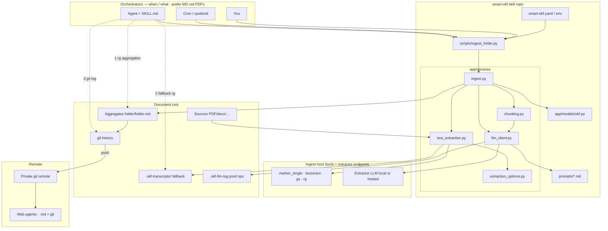

# smart-okf

* [ ] 

**[OKF](https://github.com/GoogleCloudPlatform/knowledge-catalog/blob/main/okf/SPEC.md) knowledge base for personal document folders** — health, insurance, government mail, provider contracts.

### Core goal and purpose

| Layer                      | Role                                                                                                                   |
| -------------------------- | ---------------------------------------------------------------------------------------------------------------------- |
| **Aggregates**       | **Library of atomic facts** — IDs, date ranges, amounts, parties, provenance, greppable per folder              |
| **Synthesis**        | **Librarian** — notices the same story across docs/folders, conflicts (“fights”), patterns, and next steps    |
| **Retrieval ladder** | Agents actually*use* that library (whole tree → MD → transcripts → git), not “open one topical folder and hope” |

OCR and extraction are means. **Pre-distilled facts + cross-matter synthesis + mandatory agent retrieval** is the product: compile once, then keep reasoning over the compiled knowledge so agents stop re-deriving form-critical facts from raw PDFs every time.

Ships as a [Claude Code agent skill](SKILL.md): no server, no daemon, no webapp. Web agents without your NAS consume finished Markdown via a [private git remote](#remote-access-via-git).

### What we add on top of LLM-wiki / OKF

Pre-distilling knowledge into markdown is **not unique** — [Karpathy’s LLM wiki](https://gist.github.com/karpathy/442a6bf555914893e9891c11519de94f) and OKF already describe that. smart-okf productizes a hard vertical:

| Contribution                                             | Why it matters                                                                                                                                                                                                                                                                                                                                                                       |
| -------------------------------------------------------- | ------------------------------------------------------------------------------------------------------------------------------------------------------------------------------------------------------------------------------------------------------------------------------------------------------------------------------------------------------------------------------------ |
| **Pipeline from a real filesystem tree**           | PDF/scan/docx/eml/xlsx → OCR/marker → LLM → OKF section,**unattended** (cron/CLI) — not only “drop one article into raw/ and chat”                                                                                                                                                                                                                                       |
| **Orchestrator vs extractor (degree of privacy)**  | Script always runs extraction so cron = interactive.**Default:** local/LAN extractor so raw docs need not enter a cloud chat. **Optional:** point `SMART_OKF_LLM_HOST` at a hosted model (`allow_remote_llm`) if you accept that tradeoff. Query-time agents (local *or* hosted) should still answer from **MDs + transcripts + git**, not re-read every PDF |
| **Folder aggregates + hash-incremental re-ingest** | Practical for hundreds of personal files; cheap re-runs                                                                                                                                                                                                                                                                                                                              |
| **Transcripts as mandatory retrieval fallback**    | Exact periods, IDs, quotes when the aggregate is thin                                                                                                                                                                                                                                                                                                                                |
| **Skill = retrieval ladder**                       | Whole-tree`rg` → MD → transcripts → git+IDs — the product, not “we have markdown”                                                                                                                                                                                                                                                                                            |
| **Git as version timeline + ID-bearing commits**   | Ops for life archives and matter linking over months                                                                                                                                                                                                                                                                                                                                 |

**Library vs librarian:** aggregates cover write-time extraction (the library). **Synthesis passes** (matter linking, conflicts, patterns, actions — R2 / R2b) are the librarian. Both are core purpose. See [Roadmap](#roadmap).

---

## Contents

- [Core goal and purpose](#core-goal-and-purpose)
- [What we add on top of LLM-wiki / OKF](#what-we-add-on-top-of-llm-wiki--okf)
- [Core concepts](#core-concepts)
  - [Why this exists: the retrieval ladder](#why-this-exists-the-retrieval-ladder)
  - [OKF in one paragraph](#okf-in-one-paragraph)
  - [Orchestrator vs extractor](#orchestrator-vs-extractor)
  - [Git vs Markdown](#git-vs-markdown)
  - [Why a script (not pure agent inference)](#why-a-script-not-pure-agent-inference)
- [Architecture](#architecture)
  - [Component flow](#component-flow)
  - [How retrieval works (implemented)](#how-retrieval-works-implemented)
  - [What this is not](#what-this-is-not)
- [Why not just use X?](#why-not-just-use-x)
- [Features](#features)
- [Prerequisites](#prerequisites)
- [Installation](#installation)
- [Quick start](#quick-start)
- [Change tracking](#change-tracking)
- [Remote access via git](#remote-access-via-git)
- [LLM call log (JSONL)](#llm-call-log-jsonl)
- [Configuration](#configuration)
- [OKF output format](#okf-output-format)
- [Development](#development)
- [Roadmap](#roadmap)
- [Core principles](#core-principles)

---

## Core concepts

### Why this exists: the retrieval ladder

Personal life does not fit one folder name. A benefits form, a utility dispute, or “help with finances” needs **IDs, dates, and amounts scattered across** `providers/`, `finances/`, `insurances/`, `apartments/`, lawyers, etc. If an agent only opens the topically named folder, it fails — that failure mode is why smart-okf exists.

**Agents must follow this ladder** (also in [`SKILL.md`](SKILL.md) — do not skip steps):

| Step | Layer                               | Path / tool                                  | Use for                                                                                            |
| ---- | ----------------------------------- | -------------------------------------------- | -------------------------------------------------------------------------------------------------- |
| 0    | **Synthesis (the librarian)** | `<root>/synthesis.md`, `type: Synthesis` | Cross-folder matters, conflicts, patterns, open actions — the map naming which aggregates to read |
| 0.5  | **Matter files**              | `<root>/matters/*.md`, `type: Matter`    | A specific cross-folder case already resolved to its own dedicated, linkable file                  |
| 1    | **Aggregates**                | `**/*.md` with `type: FolderSummary`     | Distilled facts, tags, orientation summary, provenance                                             |
| 2    | **Transcripts (fallback)**    | `.okf-transcripts/<relpath>.txt`           | Exact wording, full reference numbers, quotes when the MD is thin or incomplete                    |
| 3    | **Git history**               | `git log`, `--grep`, `-S`              | What’s new, same-batch uploads, same matter months later via IDs in messages                      |
| 4    | **JSONL**                     | `.okf-llm-log.jsonl`                       | Ingest debugging**only** — never answers about the user’s documents                        |

Rules that are non-negotiable:

- Start from the top: Search the **entire document root** with `rg`, never only one topical folder.
- Prefer aggregates first; **if the answer needs a full ID, amount, or verbatim clause, fall back to transcripts** (hidden folder, still greppable) — do not re-OCR and do not invent.
- Put **stable unique identifiers** into both MD bodies (extraction) and **commit messages** after ingest so matters link across folders and months.
- Cite **source filenames** (`_Source: …_`), not only the aggregate path.

Without that ladder written into the skill, agents will not invent it reliably. Encoding it is the product.

### OKF in one paragraph

[Open Knowledge Format](https://github.com/GoogleCloudPlatform/knowledge-catalog/blob/main/okf/SPEC.md) is Google’s idea of knowledge as **plain Markdown + YAML frontmatter** — concepts you can `cat`, `rg`, and git — not a closed database. You were already heading the same direction (LLM transcripts + structured notes agents can search). smart-okf adopts OKF’s shape and adds a practical layout for personal archives: **one aggregate concept per folder** (not one `.md` per PDF), provenance fields, hash-incremental re-ingest, and the retrieval ladder above. Spec details: [`docs/OKF_SPEC.md`](docs/OKF_SPEC.md).

### Orchestrator vs extractor

| Role                   | Who                                                                  | Job                                                                               | Touch raw document bytes?                            |
| ---------------------- | -------------------------------------------------------------------- | --------------------------------------------------------------------------------- | ---------------------------------------------------- |
| **Orchestrator** | Claude Code, Hermes, OpenWebUI automation, cron, you                 | When to ingest; how to**retrieve** and answer (`SKILL.md` + `rg` + git) | Prefer**no** — answer from MD/transcripts/git |
| **Extractor**    | Model behind`SMART_OKF_LLM_HOST` / `MODEL` (local *or* hosted) | Structure text → OKF**inside** `scripts/ingest_folder.py`                | **Yes**, during ingest only                    |

The script is a subprocess so **cron and interactive runs share one engine**. That is the hard requirement.

**Privacy is a spectrum, not a dogma:**

- **Strict (default):** local/LAN extractor + allowlist — raw OCR never needs a cloud chat session.
- **Relaxed:** hosted extractor via `allow_remote_llm` if you prefer quality/convenience and accept sending extract text off-box.
- **Query time:** even a fully hosted orchestrator (Claude web on a private git clone of `.md`s) should use the **retrieval ladder on aggregates**, not re-ingest PDFs. Hosted vs local mainly changes *who runs extraction*, not *where answers should come from* after ingest.

There is still no supported mode of “skip the script; the chat agent manually OCRs every file every time” — that loses incremental hashes, transcripts, and identical cron behavior.

### Git vs Markdown

| Layer                       | Holds                                                                | Does not hold                                       |
| --------------------------- | -------------------------------------------------------------------- | --------------------------------------------------- |
| **Aggregates (HEAD)** | Current distilled truth                                              | A changelog of every ingest                         |
| **Git history**       | When knowledge appeared/changed; batch co-arrival; ID-tagged commits | The only place for current facts (those live in MD) |

**Two birds:** (1) one commit after a batch upload correlates co-arrival across folders; (2) **IDs in the commit message** (Aktenzeichen, contract #, …) make the same matter greppable months later. Case-event dates from the documents still belong **in the MD body** as facts. Root “one matter” files (roadmap R2) only when IDs + batches still aren’t enough.

### Why a script (not pure agent inference)

| Need                                  | Pure agent on PDFs every time | Script                               |
| ------------------------------------- | ----------------------------- | ------------------------------------ |
| Unattended re-ingest                  | No agent online               | Cron runs the same CLI               |
| Incremental skip                      | Easy to re-do everything      | `source_hashes`                    |
| OCR / marker / transcripts / headings | Re-prompt fragile             | Implemented once                     |
| Same result for every orchestrator    | Each agent reinvents          | One contract                         |
| Optional privacy of raw extract       | Bytes may enter chat context  | You choose local vs hosted extractor |

The skill teaches **retrieval + when to run the engine**. The script *is* the engine.

---

## Architecture

### Component flow



**Install tools** (`uv`, CLIs, LLM server) on the machine that runs ingest — not necessarily on a NAS that only stores documents.

### How retrieval works (implemented)

This is the retrieval system. It is intentional and complete for the current product:

| Mechanism                                    | Role                                                            |
| -------------------------------------------- | --------------------------------------------------------------- |
| **ripgrep** over aggregates            | Primary full-text search of distilled knowledge                 |
| **Read aggregates**                    | Orientation summary + per-source sections + frontmatter         |
| **ripgrep over `.okf-transcripts/`** | **Mandatory fallback** when MD is thin (full IDs, quotes) |
| **git log / grep / pickaxe (`-S`)**  | Time, batches, ID-linked history                                |
| **Provenance lines**                   | Cite real filenames                                             |
| **Whole-tree search**                  | Cross-folder blindness prevention                               |

There is **no separate search daemon**. Q&A does not call the extractor LLM. Ingest writes the layers; the skill tells agents how to walk them.

### What this is not

These are **common industry approaches to large-corpus search**, not missing checklist items you “forgot,” and **not** on the committed roadmap unless you later hit scale pain:

| Approach                                   | What it is                         | Why not default here                                                         |
| ------------------------------------------ | ---------------------------------- | ---------------------------------------------------------------------------- |
| Vector / embedding RAG                     | Chunk → embed → nearest-neighbor | Privacy, infra, weaker exact-ID match than`rg` on structured MD            |
| BM25 / search engine service               | Ranked full-text server            | Extra process; plain`rg` + good extraction is enough for personal archives |
| Graph DB of entities                       | Explicit matter graph              | R2-style MD/git is lighter for this use case                                 |
| Query rewriter / multi-hop agent framework | Extra model loops                  | The ladder*is* the multi-hop procedure                                     |

If folders grow huge and `rg` alone feels weak, *then* evaluate BM25 or hybrid search — as an optional upgrade, not a prerequisite for usefulness.

---

## Why not just use X?

| Alternative                                               | Good fit if…                        | Gap                                                                        |
| --------------------------------------------------------- | ------------------------------------ | -------------------------------------------------------------------------- |
| **[Paperless-ngx](https://docs.paperless-ngx.com/)** | Mature OCR + search + correspondents | Docs live in its DB; no LLM-distilled greppable OKF facts next to files    |
| **OpenWebUI RAG**                                   | Chat with PDFs, zero structure       | No portable structured facts, weak provenance, no agent retrieval contract |

smart-okf’s differentiator: **automated pipeline on a personal folder tree** + **explicit agent retrieval ladder** + **git as timeline** + optional local-first extraction — not “we invented markdown knowledge.” See [What we add on top of LLM-wiki / OKF](#what-we-add-on-top-of-llm-wiki--okf).

---

## Features

| Capability                                                                                                                                                    | Status                                                               |
| ------------------------------------------------------------------------------------------------------------------------------------------------------------- | -------------------------------------------------------------------- |
| One aggregate OKF`.md` per folder, non-recursive                                                                                                            | ✅                                                                   |
| PDF, txt, docx, eml, csv, xlsx, images                                                                                                                        | ✅                                                                   |
| marker PDF backend (external CLI;`--no-marker` → pdfplumber + OCRmyPDF)                                                                                    | ✅ Default on                                                        |
| Raw transcripts`.okf-transcripts/` (lossless + **query fallback**)                                                                                    | ✅                                                                   |
| Hash-incremental re-ingest (`source_hashes`)                                                                                                                | ✅                                                                   |
| Orientation summary + optional mermaid timeline                                                                                                               | ✅                                                                   |
| Chunking oversized text (character budget)                                                                                                                    | ✅                                                                   |
| Optional vision model for handwriting + scene                                                                                                                 | ✅ Opt-in                                                            |
| Agent skill with**mandatory retrieval ladder**                                                                                                          | ✅                                                                   |
| Git timeline + ID-bearing commits                                                                                                                             | ✅ Convention                                                        |
| Private git remote for web agents                                                                                                                             | ✅ Decision (R1)                                                     |
| JSONL LLM call log (ops, not knowledge)                                                                                                                       | ✅                                                                   |
| **Dream pass** (`scripts/dream.py`): cheap cross-folder scan + free non-LLM grouping → fact-dense deep dive per candidate matter → `synthesis.md` | ✅ Hash-incremental, two-pass (R2b)                                  |
| Cross-folder auto "matter" files (`matters/<slug>.md`, `type: Matter`, per-matter concepts)                                                               | ✅ Hash-incremental per matter (R2)                                  |
| **Plausibility validator** (`scripts/validate_okf.py`): empty `sources:`, missing citations (type-aware), thin body, leaked frontmatter, template placeholders, repetition loops, chat-reply commentary | ✅ Deterministic, no LLM call |
| **Dashboard** (`scripts/dashboard.py`): static, read-only HTML — MD browser, git graph, config summary | ✅ No server/daemon; serve the one file yourself if you want (Tailscale/LAN) |
| **Mandatory fact verification** (`app/services/fact_verification.py`): every extraction is checked against its own source text before being written; failures are kept (not dropped) but marked`_Verification: FLAGGED — <reason>_` and counted toward exit code 2 | ✅ Always on, not opt-in; configurable`verify_model`/`verify_host` |
| **Roll-up hierarchy** (`app/services/ingest.py`): every folder with subfolders links down to its children (`## Untergeordnete Ordner`); pure parents get a`type: FolderIndex`. Findbuch-Prinzip — links, never re-summarizes | ✅ Core, always on, incremental |
| **Self-updating navigation** `README.md`(`app/services/navigation.py`): per-folder links + at-a-glance stats, Nextcloud-browsable; never clobbers a hand-written README | ✅ Regenerated each ingest |
| **Gating** (`app/services/gating.py`): exclude patterns skip junk from ingest; eager deprioritization keeps manuals/AGBs out of `dream`; password-protected files skipped + logged | ✅ Deterministic; onboarding-configured |
| **Per-file derived facts** (`.okf-facts/<file>.md`) | ⚙️ Opt-in (`derive_per_file`); facts always in the aggregate regardless |
| **Archival principle switch** (`ordering_principle`: provenance/pertinence) tuning cross-folder matter aggressiveness — see [docs/ARCHIVAL_PRINCIPLES.md](docs/ARCHIVAL_PRINCIPLES.md) | ✅ Onboarding-chosen |
| Vector RAG / BM25 service                                                                                                                                     | ❌ Not planned as default — see[What this is not](#what-this-is-not) |

---

## Prerequisites

| Tool                                                            | Purpose                                                                                                 |
| --------------------------------------------------------------- | ------------------------------------------------------------------------------------------------------- |
| [uv](https://docs.astral.sh/uv/)                                 | Python env                                                                                              |
| OpenAI-compatible LLM server                                    | Extraction (LM Studio, llama.cpp, Ollama, vLLM)                                                         |
| [ripgrep](https://github.com/BurntSushi/ripgrep) (`rg`)        | **Query**                                                                                         |
| `tesseract`, `ghostscript`                                  | Image OCR / OCRmyPDF path                                                                               |
| [marker](https://github.com/datalab-to/marker) `marker_single` | Default PDF path —**external** install (`pipx install marker-pdf`), not a pip dep of this repo |

marker: GPL-3.0 + modified OpenRAIL-M weights; free for personal/research use; commercial redistribution may need a [datalab.to](https://www.datalab.to/pricing) license. Opt out with `--no-marker`.

First run: ask your agent to follow [Onboarding](SKILL.md#onboarding-first-run).

---

## Installation

```bash
git clone https://github.com/TuxLux40/smart-okf.git
cd smart-okf
uv sync --group dev
ln -s "$(pwd)" ~/.claude/skills/smart-okf   # Claude Code skill
```

---

## Quick start

### 1. Ingest

```bash
uv run python scripts/ingest_folder.py /path/to/your/documents \
  --host http://127.0.0.1:1234 --model <your-model>
```

```
documents/
├── documents.md      ← aggregate of files in this folder only
├── contract.pdf
└── genealogy/
    ├── genealogy.md  ← separate aggregate
    └── birth.pdf
```

### 2. Re-run when files change

```bash
uv run python scripts/ingest_folder.py /path/to/your/documents
# or, with smart-okf.yaml:
uv run python scripts/ingest_folder.py
```

Incremental: unchanged SHA-256 → no LLM call.

```cron
0 3 * * 0  cd /path/to/smart-okf && uv run python scripts/ingest_folder.py
```

### 3. Query via the skill

Ask the agent a real question. It **must** use the [retrieval ladder](#why-this-exists-the-retrieval-ladder): whole-tree `rg` on aggregates → transcripts if thin → git for history/IDs. Not “open one folder and guess.”

---

## Change tracking

After each ingest, commit the document root. **Commit messages must include stable IDs** from new/changed sections:

```bash
git add -A
git commit -m "Ingest 2026-07-18: ACME-Energy 123456789, TeleNet; providers+finances"
git log --grep='123456789' -i
git log -S '123456789' -- '*.md'
```

See [Git vs Markdown](#git-vs-markdown). Bad OCR/summary → `git revert`, not silent loss.

---

## Remote access via git

**R1 decided:** private git remote (Gitea / Forgejo / GitLab self-hosted, ideally Tailscale) of aggregates — not a smart-okf API server, not re-OCR in the browser.

1. Ingest locally
2. Commit (with IDs)
3. Push (often **Markdown-only**; keep PDFs on NAS)
4. Web agents clone/pull or use a host connector

Gitea is a **git remote**, not an MCP server. Optional MCP can wrap a *clone*; git stays source of truth.

---

## LLM call log (JSONL)

`<documents>/.okf-llm-log.jsonl` — model, duration, retries, success. **Ops only.** Usually gitignored. Not part of the retrieval ladder for user questions.

```bash
rg '"success": false' /path/to/documents/.okf-llm-log.jsonl
```

---

## Configuration

Load order: field defaults → `smart-okf.yaml` → `SMART_OKF_*` env. See [`smart-okf.example.yaml`](smart-okf.example.yaml) and [onboarding](SKILL.md#onboarding-first-run).

| Variable                   | Default                    | Role                                                                                           |
| -------------------------- | -------------------------- | ---------------------------------------------------------------------------------------------- |
| `SMART_OKF_LLM_HOST`     | `http://localhost:11434` | Extractor endpoint                                                                             |
| `SMART_OKF_LLM_MODEL`    | `qwen2.5:3b`             | Extractor model                                                                                |
| `SMART_OKF_LLM_API_KEY`  | `not-needed`             | If required                                                                                    |
| `SMART_OKF_VISION_MODEL` | unset                      | Optional vision for images                                                                     |
| `SMART_OKF_DREAM_MODEL`  | unset                      | Dreamer model (falls back to`LLM_MODEL`) — use the smartest you have; dreaming is reasoning |
| `SMART_OKF_DREAM_HOST`   | unset                      | Dreamer server (falls back to`LLM_HOST`); remote hosts need `allow_remote_llm`             |
| `SMART_OKF_CONFIG`       | `smart-okf.yaml`         | Config path                                                                                    |

Remote non-allowlisted hosts need `allow_remote_llm`. Suffixes: [`app/constants.py`](app/constants.py).

---

## OKF output format

```yaml
---
type: FolderSummary
title: Contracts
description: Aggregated extraction of 2 document(s) in contracts/2024
tags: [legal, contract]
sources:
  - contracts/2024/lease.pdf
  - contracts/2024/isp.pdf
source_hashes:
  lease.pdf: 4a1f...
  isp.pdf: 9c02...
---

Orientation summary…

## Lease

_Source: lease.pdf_

…

## Isp

_Source: isp.pdf_

…
```

Code: [`app/models/okf.py`](app/models/okf.py). Conventions: [`docs/OKF_SPEC.md`](docs/OKF_SPEC.md).

---

## Development

```bash
uv sync --group dev
uv run ruff check --fix . && uv run ruff format .
uv run mypy app scripts tests
uv run pytest -q
```

```
app/
├── config.py
├── models/okf.py
└── services/          # ingest, llm_client, text_extraction, chunking, …
SKILL.md               # onboarding · ingest · **retrieval ladder**
scripts/ingest_folder.py
docs/OKF_SPEC.md
docs/DESIGN.md
docs/HANDOFF_FOR_CLAUDE.md
```

---

## Roadmap

**Priority shift (2026-07-19):** Keep **all** useful reasoning. What is superseded is **Honcho’s infrastructure and naming**, not the *goals* of background synthesis.

| Layer                                                            | What it does                                                                | Status                                                                                                                     |
| ---------------------------------------------------------------- | --------------------------------------------------------------------------- | -------------------------------------------------------------------------------------------------------------------------- |
| **Extract → aggregate** (shipped)                         | Facts, IDs, periods, provenance, per-folder summary                         | Solid; keep hardening (esp. date ranges)                                                                                   |
| **Retrieval ladder** (shipped as skill)                    | Whole-tree use of that distilled layer                                      | Core product; invest more                                                                                                  |
| **Re-ingest automation**                                   | Cheap, reliable updates when files change                                   | Invest more                                                                                                                |
| **Matter / synthesis passes** (ex–derive/dream *goals*) | Cross-doc/folder: same matter, conflicts, patterns, suggested links/actions | **Shipped** — `scripts/dream.py` → root `synthesis.md` (R2b) + dedicated `matters/<slug>.md` per matter (R2) |

| ID                     | Focus                                                | Status / notes                                                                                                                                                                                                                                                                                                                                                                                                                                                                                                                      |
| ---------------------- | ---------------------------------------------------- | ----------------------------------------------------------------------------------------------------------------------------------------------------------------------------------------------------------------------------------------------------------------------------------------------------------------------------------------------------------------------------------------------------------------------------------------------------------------------------------------------------------------------------------- |
| **R1**           | Private git remote for web agents                    | **Decided** — ops examples only                                                                                                                                                                                                                                                                                                                                                                                                                                                                                              |
| **R-ret**        | Retrieval pipeline                                   | Ladder + helpers; agents must use pre-distilled MDs                                                                                                                                                                                                                                                                                                                                                                                                                                                                                 |
| **R-ingest**     | Automated re-ingestion                               | Cron, change detection, ID-bearing commits                                                                                                                                                                                                                                                                                                                                                                                                                                                                                          |
| **R2**           | Cross-doc / cross-folder**matter** recognition | **Shipped** — `app/services/matter_files.py`: candidate groups from `matter_grouping.py` each get a dedicated, hash-incremental `matters/<slug>.md` (`type: Matter`), linking the involved aggregates and carrying the deep-dive Matter/Conflicts/Actions write-up. Skips the deep-dive LLM call per matter when that matter's own aggregates are unchanged, even if the run was triggered by an unrelated change elsewhere                                                                                          |
| **R2b**          | **Synthesis / “dream-class” reasoning**      | **Shipped v1 + v2**: `scripts/dream.py` — cheap digest scan across all aggregates for a baseline report, plus a free non-LLM pre-filter (`app/services/matter_grouping.py`, shared reference numbers) that finds candidate matters and deep-dives their **full** aggregate text for fact-dense Matters/Conflicts (Patterns stays cheap-scan); one root `synthesis.md` (`type: Synthesis`), cited aggregate paths, hash-incremental, batched+consolidated on large KBs/matters. Not Honcho Postgres/queue/peers |
| **R3**           | Extraction verbosity valve                           | Tunable detail                                                                                                                                                                                                                                                                                                                                                                                                                                                                                                                      |
| **R4**           | Semantic near-duplicates                             | Look-alike letters                                                                                                                                                                                                                                                                                                                                                                                                                                                                                                                  |
| **R5**           | Cron install/list/remove helpers                     | Ops UX                                                                                                                                                                                                                                                                                                                                                                                                                                                                                                                              |
| **R6**           | Docling optional backend                             | Evaluated, not adopted                                                                                                                                                                                                                                                                                                                                                                                                                                                                                                              |
| **R-geo**        | Genealogy**addon** profile                     | Optional — not a rebrand                                                                                                                                                                                                                                                                                                                                                                                                                                                                                                           |
| **R-mkt**        | Marketing / virality concept                         | Strategy + sample demo                                                                                                                                                                                                                                                                                                                                                                                                                                                                                                              |
| ~~Honcho as product~~ | Port Honcho derive/dream*stack*                    | **Superseded** — same *reasoning aims* live under R2 / R2b                                                                                                                                                                                                                                                                                                                                                                                                                                                                 |

History and cut scope: [`docs/DESIGN.md`](docs/DESIGN.md).

---

## Core principles

1. **Library + librarian** — aggregates = atomic facts; synthesis = same story, fights, next steps. Honcho inspires the *passes*, not a product fork.
2. **Retrieval ladder is mandatory** — whole tree → aggregates → **transcripts as fallback** → git; never JSONL for document answers.
3. **Compile then synthesize** — extract is not the ceiling of reasoning.
4. **Privacy is a degree** — default local/LAN extract; hosted extract optional; query prefers MD.
5. **Files stay yours** — no proprietary document DB.
6. **Git = timeline; MD = current truth** — IDs in bodies and commit messages.
7. **OKF native** — portable Markdown + frontmatter, automated for personal trees.
8. **Script = extractor; skill = retrieval + control plane.**
9. **Bring your own LLM** for extraction (local preferred, remote optional).

---

## Related

Inspired by understory (Codacus), Karpathy-style LLM wikis, and Google’s [OKF](https://github.com/GoogleCloudPlatform/knowledge-catalog/tree/main/okf). Format: [`docs/OKF_SPEC.md`](docs/OKF_SPEC.md).

## License

[MIT](LICENSE)
