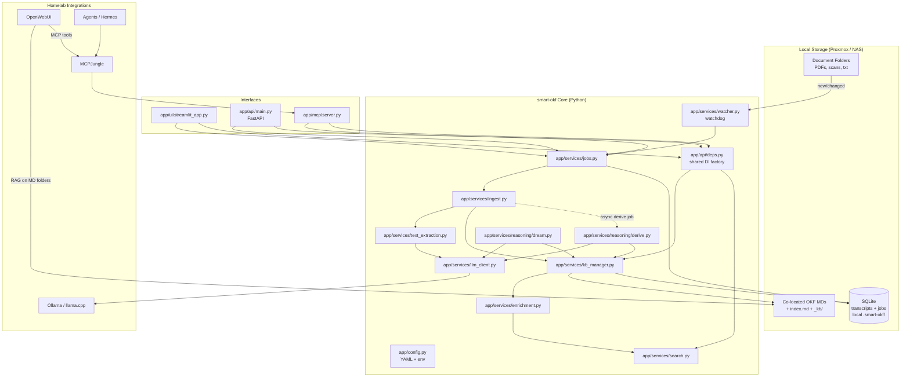
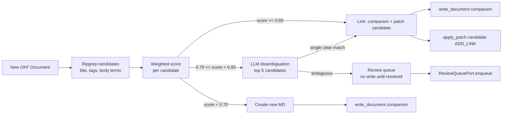
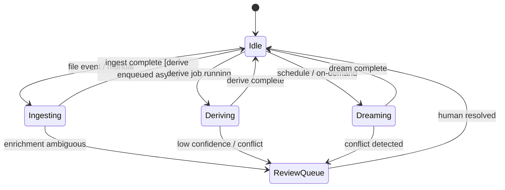

# smart-okf: System Design Document (Phase 0–3)

| Field | Value |
|-------|-------|
| **Author** | Oliver (homelab maintainer) |
| **Reviewers** | Design review pass 1 (2026-07-16) |
| **Date** | 2026-07-16 |
| **Version** | 0.4 (re-review round 2) |
| **Status** | Draft |
| **Scope** | Full local-first OKF knowledge base — Phase 0 scaffolding through Phase 3 MCP/agent integration |
| **Repository** | `/home/oliver/Projects/smart-okf` |

### Revision History

| Version | Date | Changes |
|---------|------|---------|
| 0.1 | 2026-07-16 | Initial draft |
| 0.2 | 2026-07-16 | Addressed 20 review issues: dependencies, reasoning contract, enrichment scoring, job concurrency, colocation clarity, PR reorder, config schema, MCP direct-service coupling, API validation, derive async defaults, MVP milestones |
| 0.3 | 2026-07-16 | Re-review round 1: fixed ingest sequence diagram, reasoning path validation, subdir resolver, op→patch mapping, composition root wiring, URL-aware llm_host validator |
| 0.4 | 2026-07-16 | Re-review round 2: fixed sequence diagram write steps, enrichment link+companion policy (Option A), multi-root KBManager map, Phase 1 cut line → PR 11 |
| 0.5 | 2026-07-17 | **Scope trimmed** — see amendment below. Sections after this point describe the original full design and are kept as reference/aspirational-future only; they no longer reflect current implementation direction. |

### 2026-07-17 Scope Amendment

Actual goal restated: agents get easy query access to personal documents (health, insurance,
government, providers, etc.), not a general-purpose data-catalog platform. Concrete deltas from
everything below:

- **Co-location: one aggregate `.md` per folder, not per file, non-recursive.** Each folder's
  aggregate (`<folder>/<folder-name>.md`) covers only files directly inside it — a subfolder gets
  its own separate aggregate, its content is never rolled up into the parent's. Replaces the
  `companion`/`subdir`/`mixed` resolver design in §"Co-location Strategy" entirely — implemented in
  `app/services/ingest.py` (`build_folder_summary`, `folder_summary_path`).
- **Cron over folder watcher.** No `watchdog`-based long-running process (PR 10, §"Folder
  Watcher") — a scheduled `ingest` run (cron/systemd timer) is simpler and documents don't need
  processing the instant they're saved.
- **LLM backend: any OpenAI-compatible server**, not Ollama-specific — `app/services/llm_client.py`
  speaks `/v1/chat/completions` directly (works against Ollama, llama.cpp's `llama-server`, LM
  Studio, vLLM).
- **Enrichment gate, dream/derive reasoning, FastAPI, MCP tools (PR 6–18 below) are optional/later,**
  not committed scope. Build them only if the simple ingest → aggregate → search loop turns out to
  be insufficient.
- SQLite (§"Job System", §"Review queue") was never meant to be the knowledge store — MD files stay
  source of truth; SQLite is auxiliary (job dedup, review-queue persistence). Not needed until/if
  the optional pieces above are built.

### 2026-07-19 Priority amendment — core purpose locked

**Canonical purpose (user-confirmed wording):**

> Aggregates = library of atomic facts.  
> Synthesis = librarian that notices the same story, fights, and next steps.  
> Honcho-as-architecture is out. Honcho-as-inspiration for smarter passes over MDs is in.

- **Folder aggregates = write-time compile** (facts, IDs, date ranges, provenance, folder
  orientation). Necessary; not the ceiling.
- **Honcho product stack** superseded; **derive/dream *goals*** ship as R2 / R2b matter +
  synthesis passes (`prompts/reasoning_*.md` as seeds).
- **Retrieval ladder** is how agents use the library (mandatory skill contract).
- **Investment order:** retrieval quality → automated re-ingest → matter/synthesis reasoning.
- **Privacy spectrum:** local extract default; hosted extract optional; query prefers MD.
- Positioning vs LLM-wiki/OKF: automate personal-folder ingest + retrieval + synthesis path.

### 2026-07-18 Roadmap: hardening + follow-ups

Shipped since the amendment above (first live ingest run surfaced real gaps): image OCR via
tesseract, in-place OCRmyPDF for scanned PDFs, a `.okf-transcripts/` raw-text sidecar store
(lossless, so extraction never repeats), hash-incremental re-ingest, LLM request retries, tolerant
frontmatter parsing, inner-heading demotion (fixes silent truncation on re-ingest), a synthesized
orientation summary + optional mermaid timeline per aggregate, and git-based change tracking for
the document root itself.

Still open — numbered independently from the legacy PR 0–18 plan above (which this amendment
already superseded) to avoid implying they continue that sequence:

#### PR R1: Remote agent access — **decided: private git remote**

**Problem:** Web-based agents (Claude, others) need read access to the KB without a local
filesystem on the user's NAS.

**Decision (2026-07-18):** **Private git remote is the sync mechanism.** Ingest stays local;
push finished aggregates (optionally Markdown-only) to Gitea/Forgejo/GitLab self-hosted (or
similar), preferably over Tailscale/LAN — not a public GitHub dump of personal PDFs. Web agents
consume Markdown via clone/pull or a product connector; they do not re-run OCR.

**MCP is optional glue, not the source of truth.** A Gitea repo is not an MCP server by itself.
If a product wants tool-calling APIs, an MCP process can wrap a *checkout* of that remote
(search/read). Building a smart-okf-native MCP server (option 2 below) stays optional/later —
revives the `mcp` dependency only if we need finer-grained tools than “git + ripgrep on a clone.”

**Rejected as primary:** custom FastAPI KB server for remote access (cut earlier); public git
hosts for full document trees without careful filtering.

**Operational follow-through (not greenfield product code):** document push filters (e.g. only
`*.md`), example remotes, and how Claude web / other agents attach to a private repo or MCP-
wrapped clone — see README §"Remote access via git".

#### PR R2: Cross-folder consolidation pass

**Principle (2026-07-18):** **git = ingest/version timeline; MD = current distilled truth.**
Agents should use `git log` / commit batches for “what landed together,” not changelogs inside
aggregates. R2 is only for matters that span folders when **batch correlation is not enough**
(same case across uploads months apart). Prefer whole-tree search + git history first.

**Problem:** A single real-world matter (a utility dispute, a benefits application) is scattered
across multiple *folders'* aggregates, not just multiple documents in one folder — the same
cross-folder blindness the "always search the whole root" rule in `SKILL.md` works around at
query time, but nothing currently *writes* the connection down. A user should get a dedicated
root-level concept file the moment ingest notices, say, an energy-provider dispute's aggregate
sharing an account/case reference with a bank-statement aggregate and a debt-collection letter's
aggregate in a different folder.

**Design sketch:** After an ingest run produces one or more changed aggregates, a consolidation
pass compares each changed aggregate's key identifiers (reference numbers, sender names, entities
named in `tags`) against every *other* existing aggregate's frontmatter+summary (not full text —
cheap enough to run on every changed aggregate). On a match, write or update a plain (non-hidden —
this is a real user-facing concept, unlike `.okf-transcripts/`) root-level file, e.g.
`<root>/<slug>.md`, `type: CrossReference`, linking the involved aggregates and stating the
connection in prose. Reuses the existing `OKFDocument`/frontmatter machinery; no new model needed
beyond a new `type` value in the vocabulary (`docs/OKF_SPEC.md`).

**Files:** `app/services/consolidate.py` (new), a new prompt `prompts/cross_reference.md`, wired
into `ingest_folder()` as an optional post-pass (`features.cross_folder_consolidation`, off by
default until proven useful — an LLM comparison per pair of aggregates doesn't scale unbounded, so
this needs a cheap pre-filter — e.g. shared tokens in `tags`/reference-number regexes — before any
LLM call).

#### PR R3: Extraction verbosity valve

**Problem:** What counts as noise is subjective (company-officer boilerplate is irrelevant to the
document owner but might matter to a different user of the published skill) — a single hardcoded
extraction prompt can't fit everyone.

**Design sketch:** A `smart-okf.yaml` `features.extraction_verbosity: concise | standard |
verbose` (or similar) setting that swaps in a prompt variant / prompt suffix. Whether it's set via
plain config or a first-run onboarding interview (Honcho-style) is a product decision, not an
engineering one — needs discussion before implementation.

**Files:** `app/models/config.py` (new field), `prompts/extraction_system.md` split into a base +
verbosity-suffix, or 2-3 full prompt variants.

#### PR R4: Semantic near-duplicate detection

**Problem:** `source_hashes` only catches byte-identical files. Real near-duplicates — near
identical government letter templates that differ only in which matter they pertain to — need
content comparison, not hashing.

**Design sketch:** On ingest, when a new document's extracted frontmatter (`type` + sender/entity
tags) closely matches an existing document already in the same aggregate, run one extra LLM call
asking "same matter or different?" with both raw texts, and record the verdict — either merging as
one logical item or flagging both with a `related_documents` cross-reference. Needs a concrete
scoring/pre-filter step (same as R2) so this doesn't become O(n²) LLM calls per folder.

**Files:** extends `app/services/ingest.py` (`extract_document`/`_ingest_directory`), a new
prompt `prompts/duplicate_check.md`.

#### PR R5: Cron management commands

**Problem:** `SKILL.md` only documents a crontab line to copy by hand; nothing installs, lists, or
removes it.

**Design sketch:** `scripts/ingest_folder.py` gains `--install-cron`/`--list-cron`/`--remove-cron`
subcommands (or a separate `scripts/manage_cron.py`) wrapping `crontab -l`/`crontab -` diffing in
a marked block, so re-running install is idempotent. Depends on the access-model decision (R1)
only loosely — independent otherwise.

#### PR R6: Docling as a swappable extraction backend

**Problem:** `app/services/text_extraction.py` hand-rolls per-format extraction (pdfplumber,
python-docx, stdlib email, openpyxl/csv). [Docling](https://github.com/docling-project/docling)
(IBM/LF AI, MIT) unifies PDF/DOCX/XLSX/CSV/`.eml` behind one API and has genuine `.eml` support
most general document tools lack — evaluated 2026-07-18, not adopted: its standard PDF pipeline
still requires PyTorch (`docling-ibm-models`, see upstream issue #648), so it's no lighter than
marker despite being MIT and importable directly; its native output is its own `DoclingDocument`
structure, not markdown, so the OKF-translation work in `ingest.py` wouldn't shrink; and it has no
equivalent to OCRmyPDF's in-place searchable-PDF rewrite.

**Design sketch, if revisited:** a `text_extraction_backend: pdfplumber | docling` config switch
(same shape as `use_marker`), Docling as an actual pip dependency (its license allows it, unlike
marker) behind an extras group so users who don't want the PyTorch weight can skip installing it.
Only worth doing if pdfplumber/OCRmyPDF quality becomes a specific, named pain point — not before.

### 2026-07-18: chunking, call logging, marker (shipped); langfuse (rejected)

User surfaced three external libraries (chonkie, langfuse, marker) found in a video. Evaluated
and decided:

- **Chunking guard, shipped (stdlib only).** Confirmed real bug: no length/token guard existed
  anywhere in the pipeline — `extract_document()` sent arbitrary-size text to the LLM in one
  call, silently failing (3 retries then "skipped") on documents exceeding the model's context.
  `app/services/chunking.py` splits oversized text (>`CHUNK_CHAR_THRESHOLD` chars) with a
  character-budget greedy splitter (paragraph/line/space preferred). An earlier draft used
  chonkie's RecursiveChunker; dropped as overkill for character mode. `extract_document()`
  extracts per chunk and `merge_chunk_documents()` merges back into one document (tags union;
  empty first-chunk title/description/source filled from later chunks), preserving the
  one-file-one-aggregate-section invariant.
- **JSONL LLM call log, shipped, as the langfuse alternative.** Langfuse (self-hosted needs
  Postgres + ClickHouse + Redis + S3) was rejected outright — categorically heavier
  infrastructure than anything else in this codebase, and directly contradicts the no-server/
  no-daemon principle for what would observe an occasional cron-run batch job. Instead,
  `LLMClient.chat()` optionally writes one JSON line per call outcome to
  `<root>/.okf-llm-log.jsonl` (model, duration, retry count, success/failure) — dependency-free,
  local, greppable. Wired on by default for real ingest runs (`ingest_folder()`'s default
  client construction), silent no-op if `log_path` is unset (tests).
- **marker PDF backend, shipped, external-CLI only, opt-out (flipped from opt-in 2026-07-18).**
  marker (layout-aware PDF→markdown, GPL-3.0 code + modified-OpenRAIL-M model weights) is
  invoked via `marker_single` subprocess unless `--no-marker`/`use_marker: false`
  (smart-okf.yaml) is set — **never a pip dependency / never bundled in this repo**. Onboarding
  (or the user) installs it externally (`pipx install marker-pdf`) when the skill is set up,
  same as `tesseract`/`ghostscript`. That is intentional: PyTorch + marker's licenses stay
  outside smart-okf's MIT graph so the published skill stays clean; the skill only shells out
  to a PATH binary. Explicit-fails (not silent fallback) if marker is expected (default) but
  `marker_single` isn't on PATH. Install tools on the **machine that runs ingest / hosts the
  extractor model**, not on a NAS that only stores documents. Marker path does not run
  OCRmyPDF in-place (no searchable-PDF rewrite); `--no-marker` restores pdfplumber+OCRmyPDF.
  Transcript backfill for missing sidecars always uses the light path (`use_marker=False`) so
  an unchanged folder never cold-starts PyTorch just to recover a `.txt`.

### 2026-07-18: orchestrator/extractor terminology, and two evaluated-but-not-adopted ideas

Bugs found the same day (fixed): `LLMClient.model` never read `SMART_OKF_LLM_MODEL` from the
environment (only `host` had the `os.getenv` fallback — asymmetric); CLI built `LLMClient`
without `log_path` so JSONL never wrote on real runs; `_log_call` always recorded `self.model`
even for vision calls (now logs the model argument actually used). Stale `scripts/onboard.py`
error/example-yaml references removed — onboarding is agent-conversational only.

**Orchestrator vs. extractor** is now a documented, explicit distinction (README §"Orchestrator
vs. extractor"): the *orchestrator* is whatever agent invokes `scripts/ingest_folder.py` (Claude
Code, an OpenWebUI or Hermes automation, cron — no distinction between "agent-triggered" and
"cron-triggered", the script behaves identically either way); the *extractor* is the separate
local LLM the script always calls via `SMART_OKF_LLM_HOST`/`MODEL`. There is no "same" mode where
the orchestrating agent's own reasoning serves as the extractor — the script is a subprocess with
no callback into a live agent's inference, so extraction is always a second, separate LLM call
regardless of what triggered the run. An earlier framing in this conversation floated a
"skip local LLM, orchestrating agent does extraction manually" onboarding branch; on reflection
this was solving a problem that doesn't exist (scripts already serve any agent, not just cron)
and was dropped rather than built.

Two libraries were researched as candidates and **not adopted**, evaluation kept here rather than
implemented against:

- **Honcho's derive/dream loop** (the pattern `prompts/reasoning_derive.md`/`reasoning_dream.md`
  were speculatively written against) — confirmed via Honcho's own source/docs: derive is
  per-message/on-write via a queue-worker LLM pass producing `Document` rows in Postgres+pgvector;
  dream is idle-triggered (not clock-scheduled — a per-peer inactivity timer that new messages
  reset) and runs deduction/induction "specialist" passes plus surprisal-sampling over the
  accumulated documents; query is a third, independent on-demand path. The *shape* (write-time
  extraction vs. idle-time cross-cutting synthesis) is reusable inspiration for whatever eventually
  wires up `reasoning_derive.md`/`reasoning_dream.md` (see R2 in the Roadmap section above); the
  concrete implementation (Postgres, pgvector, queue workers) is not — none of that fits this
  project's cron/filesystem model, and porting it wholesale would be exactly the kind of
  infrastructure creep the langfuse rejection above already ruled out for the same reasons.
- **Docling** (IBM/LF AI, MIT-licensed) was considered as a replacement for the hand-rolled
  per-format logic in `app/services/text_extraction.py`. It does unify PDF/DOCX/XLSX/CSV/`.eml`
  extraction behind one API (`.eml` support is a genuine advantage most general document tools
  lack) and is permissively licensed, unlike marker — but its standard PDF pipeline still requires
  PyTorch (`docling-ibm-models`, confirmed via upstream issue #648), so it's no lighter than
  marker despite being importable; its native output is its own `DoclingDocument`
  structure, not markdown, so the OKF-translation work `text_extraction.py`/`ingest.py` already do
  wouldn't shrink; and it has no equivalent to OCRmyPDF's in-place PDF rewrite (it processes
  in-memory, produces no searchable-PDF artifact). Not worth the dependency weight for the current
  pdfplumber+OCRmyPDF+marker stack's actual pain points; worth a second look only if scanned-PDF
  extraction quality becomes a real, specific complaint.

### 2026-07-18: vision-model image transcription (handwriting + scene description), shipped

**Problem:** standalone-image ingest (`.png`/`.jpg`/`.jpeg`) only ever ran tesseract OCR — poor
on handwriting, and no way to know what a photo is even *of* beyond its printed text. Motivating
case: `providers/03_Strom/Stromzaehlerstaende/` photos of a utility meter, where the reading
itself may be a mix of a digital display and handwritten notes, and the surrounding context
(which meter, what room) has no printed text at all.

**Design decision — no new dependency, no face recognition.** The obvious paths (a dedicated
handwriting-OCR library like TrOCR, an object-detection model like YOLO, or a face-recognition
library) were deliberately not taken. Instead: `LLMClient.describe_image()` sends the image as a
base64 `image_url` content part to a *vision-capable chat model* — the same OpenAI-compatible
`/v1/chat/completions` endpoint already used for extraction, just a different (optionally
different) model name (`vision_model`/`SMART_OKF_VISION_MODEL`/`--vision-model`). Modern local
VL models (Qwen3-VL, InternVL3, MiniCPM-V, etc. — several already commonly available in LM
Studio/llama.cpp/Ollama) handle handwriting transcription and general scene description well
enough that a dedicated CV pipeline isn't justified — zero new pip dependencies, zero new
external CLI tools, reuses infrastructure that already exists for every other extraction call.

**Explicitly excluded: face/person identification.** "Basic object/people/scene recognition" was
the original ask, but identifying *who* a person in a photo is is a materially different (and
more invasive) capability than describing a scene. `prompts/vision_extraction.md` explicitly
instructs the model to note a person's presence only when contextually relevant, never a name,
appearance, or other identifying detail. If per-person identification is ever wanted, that's a
distinct, separately-scoped feature — not bundled into this one.

**Mechanics:** `extract_document()` (`app/services/ingest.py`) branches on `file_path.suffix in
IMAGE_DOCUMENT_SUFFIXES and client.vision_model is not None` — routes to `describe_image()`
instead of `extract_text_from_file()`; the returned text (transcription + scene description) then
flows through the same chunk/structure/transcript pipeline as any other document, so nothing
downstream needed to change. `vision_model` defaults to `None` (env: `SMART_OKF_VISION_MODEL`) —
unset, behavior is byte-for-byte the old tesseract-only path; no regression for anyone who
doesn't opt in. Detecting vision capability from a model name alone isn't reliable (LM Studio
doesn't expose a "vision: true" flag over `/v1/models`), so this is explicit opt-in via
onboarding/config/flag, never auto-detected.

**Verified against a real photo** of a utility meter, via `qwen3-vl-2b-instruct`: correctly
transcribed the meter serial number, tariff type, and the reading, and the scene description
flagged "a person is visible" without any identifying detail, exactly as designed. Note:
`qwen3-vl-8b-instruct` crashed LM Studio's Vulkan backend (`vk::Queue::submit:
ErrorDeviceLost`, likely VRAM pressure on the 8GB RX 7600) on the first attempt — a local
GPU/driver issue, not a smart-okf bug; the 2B model worked without issue.

### 2026-07-19: fable review fixes (8 findings) + dream synthesis pass shipped (R2b v1)

A second-model review pass (fable, per `docs/HANDOFF_FOR_CLAUDE.md`) confirmed all handoff
claims against the code and produced 8 findings, all fixed the same day:

1. **Privacy (blocking):** SKILL.md/README.md example commit messages contained a real
   contract number and real counterparties — replaced with fictional IDs (`ACME-Energy
   123456789`, `TeleNet`, `InkassoCorp`). Rule reaffirmed: nothing case-real in published files.
2. **Robustness:** `_ingest_directory` now catches `Exception` per file (was only
   `DocumentIngestError`/`LLMClientError`) — a malformed PDF (raw `PdfminerException`,
   observed live), unreadable image (`OSError` from the vision path), or corrupt docx no
   longer aborts the entire run; the file is skipped and reported.
3. **Exit codes + preflight:** `IngestFolderResult.exit_code` is now real (0 clean / 1 bad
   root / 2 partial-with-skips) and `scripts/ingest_folder.py` uses it, so cron goes red
   instead of silently green when files fail. The CLI also preflights `marker_single` once
   at startup (clear single error) instead of N per-file skips.
4. **Read-only backfill:** `ExtractionOptions.allow_ocr_rewrite` (False in
   `LIGHT_EXTRACTION`) — transcript backfill can no longer OCR-rewrite a scanned PDF in
   place during an "unchanged" pass; it raises and the backfill skips, instead of mutating
   originals and invalidating hashes.
5. **Orphan aggregates:** deleting a folder's last supported file now deletes its stale
   aggregate on the next run (`_remove_orphan_aggregate`, reported via
   `IngestFolderResult.removed_paths`). Only files with `type: FolderSummary` frontmatter
   are ever deleted — hand-written markdown sharing the folder name is untouchable.
6. **No silent section loss:** when a changed file's re-extraction fails, its previous
   section and old hash are retained (stale but present); the hash mismatch retries next
   run. Previously the section silently vanished until extraction succeeded.
7. **Vision observability:** JSONL log records `payload_bytes` (image size) — previously a
   3MB vision request logged as ~20 `prompt_chars`.
8. **Transcript consistency:** backfill skips images when a vision model is configured — no
   more tesseract transcripts contradicting vision-derived sections.

**Dream pass (R2b v1) shipped** — the librarian, per the locked core purpose. Filesystem-native,
Honcho-in-shape-only: `app/services/dream.py` + `scripts/dream.py` collect every
`type: FolderSummary` aggregate, build a compact per-aggregate digest (identity, tags,
orientation summary, section headings + `_Source:` lines — never full bodies), and make one
LLM call (`prompts/dream_synthesis.md`) producing `<root>/synthesis.md` (`type: Synthesis`)
with exactly four sections: Matters (cross-folder, join IDs verbatim), Conflicts, Patterns,
Open actions — every claim citing aggregate paths. Hash-incremental exactly like ingest:
synthesis frontmatter stores a SHA-256 per source aggregate; zero LLM calls when nothing
changed; `--force` overrides. Oversized digests are batched under `CHUNK_CHAR_THRESHOLD` and
consolidated with one final merge call. Retrieval ladder gains step 0: synthesis is the map,
aggregates/transcripts remain the truth — SKILL.md instructs agents to verify cited
aggregates before answering from the synthesis. Explicitly not built: queues, Postgres,
pgvector, idle-timers, peers — cron/on-demand invocation replaces all of them. Per-matter
concept files (R2 proper) stay on the roadmap for when one synthesis file isn't enough.

### 2026-07-19: dream pass v2 — two-pass deep dive for fact-dense matters

**Problem, surfaced by a real reference document.** The user shared a genuinely excellent
investigative case report they'd previously had an agent write by hand (full case
chronology, exact meter/contract/account numbers, a payment ledger, per-recipient action
items) as the target quality bar for dreaming. Comparing it against v1's actual output
exposed the real gap: `build_digest()` deliberately strips section bodies down to headings
only, so the dreamer's input never contains the amounts/dates/reference numbers that make a
Matters write-up dense — no amount of prompt tuning fixes an input that doesn't carry the
facts. That investigative report is also a structurally different artifact (a full
chronological single-matter narrative with tables and diagrams, built from raw
transcripts+correspondence, not a four-section cross-tree map) — not a realistic one-shot
target for a compact synthesis pass, but its *density and citation discipline* were exactly
right as a bar to raise the Matters/Conflicts sections toward.

**Design decision — two passes, cost bounded by matters found, not tree size.** Two options
were on the table: enrich the single digest-based pass (simpler, but O(tree) cost for every
run regardless of whether anything correlates), or a cheap-scan-then-deep-dive split. Chose
the split:

1. **Cheap scan** (unchanged from v1): one call over compact digests across the whole tree,
   producing a baseline four-section report. Still the only work done when nothing
   correlates.
2. **Free grouping** (`app/services/matter_grouping.py`, no LLM call): union-find over
   5+ digit numeric tokens found in digest text (filenames, tags, titles, summaries —
   whichever already carry an ID; real-world source filenames like
   `..._999888777_...pdf` put the account number right in the digest for free). Aggregates
   sharing a token become a candidate group. Singletons are dropped — nothing to correlate,
   and the cheap scan already covers them for Patterns.
3. **Deep dive** (`prompts/dream_matter.md`, `LLMClient.dream_matter()`): only candidate
   groups get a follow-up call that reads their **full** aggregate markdown (not digest) and
   produces three labeled sections (Matter/Conflicts/Actions) with exact identifiers and
   explicit logical-incompatibility reasoning ("two suppliers can't both exclusively supply
   the same meter for the same period — at most one billing is correct"). Batches +
   consolidates like the cheap scan when a matter's evidence is itself oversized.

Splicing (`_apply_deep_dives`): deep-dive output replaces the baseline's Matters/Conflicts
sections (parsed via `_split_sections`/`_join_sections`) and merges into Open actions;
Patterns always stays from the cheap scan — cross-tree trends don't need per-fact depth, and
keeping one section cheap-scan-only bounds worst-case cost. If the baseline didn't parse
into recognizable sections at all (small-model format drift), splicing is skipped entirely
and the baseline ships as-is — never risk losing content to a fragile parse.

**No regression when nothing correlates**: zero shared tokens anywhere → `groups` is empty →
`_apply_deep_dives` returns the baseline body unchanged, byte-for-byte v1 behavior, zero
extra LLM calls. Verified by a dedicated test asserting `matter_calls == []` on the existing
no-shared-tokens fixture.

Real personal content from the reference document (names, addresses, exact figures) is not
reproduced anywhere in this repo — same "no personal case names published" rule as always;
only the structural/density lessons went into the prompt.

---

## Overview

**smart-okf** is a local-first, privacy-preserving knowledge base that transforms sensitive document folders (PDFs, scans, plain text) into co-located OKF-structured Markdown companions. A Python backend orchestrates OCR, LLM extraction, enrichment, and a Honcho-inspired reasoning loop (store → derive → dream → query). Humans browse folders directly; agents access the same knowledge via ripgrep, REST API, and MCP tools registered in MCPJungle.

Phase 0 scaffolding is largely complete: Pydantic OKF models (`app/models/okf.py`), shared ingest service (`app/services/ingest.py`), Ollama LLM client (`app/services/llm_client.py`), pdfplumber text extraction (`app/services/text_extraction.py`), extraction/reasoning prompts (`prompts/`), CLI ingest script (`scripts/ingest_folder.py`), and a Streamlit skeleton (`app/ui/streamlit_app.py`). Known gaps and doc drift are catalogued in [Current State](#current-state-as-of-2026-07-16).

The design preserves existing patterns: centralized constants (`app/constants.py`), typed exception hierarchy (`app/exceptions.py`), immutable `model_copy` updates in ingest (`apply_ingest_defaults`), and shared services consumed by CLI, UI, API, and MCP layers.

---

## Background & Motivation

### Problem

Sensitive personal and homelab documents (genealogy, IT notes, legal scans) live in folder hierarchies on local storage (Proxmox/NAS). Opening every PDF to recall a date, name, or relationship is high friction. Cloud RAG solutions violate the privacy constraint. Generic note apps lack provenance, structured extraction, and agent interoperability.

### Current State (as of 2026-07-16)

| Component | Status | Location |
|-----------|--------|----------|
| OKF Pydantic models + round-trip markdown | ✅ Done | `app/models/okf.py` |
| Constants, exceptions | ✅ Done | `app/constants.py`, `app/exceptions.py` |
| LLM client (Ollama) | ✅ Done | `app/services/llm_client.py` |
| Text extraction (PDF via pdfplumber) | ✅ Done | `app/services/text_extraction.py` |
| **Image ingest** | ❌ **Broken** | `.png`/`.jpg`/`.jpeg` in `SUPPORTED_DOCUMENT_SUFFIXES` but `extract_text_from_file()` calls `read_text()` on non-PDF files — produces garbage, not `DocumentIngestError`. `easyocr` in deps but unused. |
| Folder ingest (co-located `.md`) | ✅ Done | `app/services/ingest.py` |
| Extraction prompts | ✅ Done | `prompts/extraction_system.md` |
| Reasoning prompts (not wired) | ✅ Done | `prompts/reasoning_derive.md`, `reasoning_dream.md` |
| CLI ingest script | ✅ Done | `scripts/ingest_folder.py` |
| Streamlit skeleton | ⚠️ Placeholder | `app/ui/streamlit_app.py` — uses `DEFAULT_MODEL` env key, not `DEFAULT_LLM_MODEL` (line 21) |
| Unit tests (3) | ✅ Done | `tests/test_okf.py` |
| Config module | ❌ Missing | Referenced in README, not implemented |
| Folder watcher | ❌ Missing | `watchdog` in deps, unused |
| KB manager / index.md | ❌ Missing | — |
| Enrichment gate | ❌ Missing | — |
| Derive / Dream loop | ❌ Missing | — |
| FastAPI API | ❌ Missing | `fastapi` in deps, unused |
| MCP server | ❌ Missing | — |
| SQLite transcripts | ❌ Missing | — |
| Review queue | ❌ Missing | — |

**Documentation drift:** `DEVELOPMENT_PLAN.md` still has unchecked items for `pyproject.toml`, models, and LLM client that are implemented. README references `app/config.py` which does not exist. PR 1 includes hygiene fixes.

### Pain Points to Address

1. **No incremental ingest** — only full-folder `rglob` scans; no file watcher or change detection.
2. **Broken image ingest** — images accepted but produce garbage via `read_text()`; must fail fast until OCR lands (PR 3a).
3. **No KB structure** — no `index.md`, no bidirectional links, no enrichment-before-create.
4. **Reasoning loop unimplemented** — prompts exist but no orchestration, parsing contract, or persistence.
5. **No programmatic/agent interface** — Streamlit placeholders only; no API or MCP.
6. **No observability** — no job logs, confidence scores, or provenance traces beyond `source` frontmatter field.

---

## Goals & Non-Goals

### Goals

| ID | Goal | Target |
|----|------|--------|
| G1 | Co-located OKF MD companions for supported originals | 100% of ingestible files get a companion MD (summary on link, full extract on create) |
| G2 | Human-browsable folder structure with `index.md` breadcrumbs | Every folder with ≥1 MD gets/maintains index |
| G3 | Honcho-inspired reasoning (derive on ingest, dream on schedule) | Derive <30s/doc on qwen2.5:3b (async path); dream scoped to last 7d changes |
| G4 | Local-only processing | Zero outbound network by default |
| G5 | Agent access via MCP + REST | 5 core MCP tools registered in MCPJungle |
| G6 | Review queue for low-confidence / conflicts | UI + API surfacing |
| G7 | Typed, testable Python codebase | mypy strict, pytest coverage on core paths |

### Non-Goals (Phase 0–3)

- Multi-user collaboration or cloud sync
- Embedding-based vector search (ripgrep + optional LLM rerank only)
- Graph visualization UI (Phase 4)
- Honcho library dependency
- Vision-LLM layout preservation (marker-pdf deferred to Phase 4)
- Mobile app or TUI
- `mixed` colocation mode (deferred to Phase 4 — see [Co-location Strategy](#co-location-strategy))

---

## Proposed Design

### High-Level Architecture



**MCP coupling decision:** MCP tools invoke the **service layer directly** via shared `app/api/deps.py` factories — not HTTP to FastAPI. FastAPI is a parallel entrypoint for OpenWebUI custom retrievers and non-MCP clients. This avoids two-process startup ordering, auth forwarding, and localhost HTTP overhead in MCPJungle deployments.

### Runtime & Python Dependencies

PR 0 (precedes PR 1) updates `pyproject.toml` and documents system prerequisites:

| Dependency | Purpose | Notes |
|------------|---------|-------|
| `pydantic-settings>=2.0` | `SmartOkfConfig` env + file loading | `pydantic>=2.0` alone insufficient |
| `structlog>=24.0` | Structured JSON logging | Phase 1 observability |
| `mcp>=1.0` | MCP server SDK | Official Python MCP package |
| `pyyaml` | YAML config parsing | Already declared |
| **`ripgrep` (`rg`)** | Search service | **System prerequisite**, not pip; document in README |

**YAML loading:** `pydantic-settings` v2 does not support `yaml_file=` in `SettingsConfigDict` natively. Implement a custom settings source:

```python
# app/config.py
class YamlConfigSettingsSource(PydanticBaseSettingsSource):
    """Load smart-okf.yaml via pyyaml; merge with env vars."""

    def __call__(self) -> dict[str, Any]:
        path = Path(os.getenv("SMART_OKF_CONFIG", "smart-okf.yaml"))
        if not path.exists():
            path = Path.home() / ".config/smart-okf/smart-okf.yaml"
        if path.exists():
            return yaml.safe_load(path.read_text()) or {}
        return {}

class SmartOkfConfig(BaseSettings):
    model_config = SettingsConfigDict(env_prefix="SMART_OKF_")

    @classmethod
    def settings_customise_sources(cls, settings_cls, init_settings, env_settings, dotenv_settings, file_secret_settings):
        return (init_settings, env_settings, YamlConfigSettingsSource(settings_cls),)
```

### Layered Module Layout (Target)

```
app/
  constants.py              # existing — extend with config keys, job statuses
  exceptions.py             # existing — add KBManagerError, ReasoningError, etc.
  config.py                 # NEW — SmartOkfConfig (Pydantic Settings)
  models/
    okf.py                  # existing — extend frontmatter; add_link → immutable
    kb.py                   # NEW — KBEntry, OKFPatch
    jobs.py                 # NEW — JobRecord, IngestJob, ReasoningJob
    review.py               # NEW — ReviewItem, ConflictNote
    config.py               # NEW — FeaturesConfig nested model
  services/
    ingest.py               # existing — orchestration entry; thin after PR 6b
    ingest_orchestrator.py  # NEW (PR 6b) — wires KB + enrichment + jobs + derive hook
    text_extraction.py      # existing — add easyocr; fail-fast for images (PR 3a)
    llm_client.py           # existing — add derive/dream helpers
    prompts.py              # existing — add load_derive_prompt, load_dream_prompt
    kb_manager.py           # NEW — read/write MDs, index.md, linking
    enrichment.py           # NEW — search-before-create gate + scoring
    search.py               # NEW — ripgrep wrapper + LLM rerank + Python fallback
    watcher.py              # NEW — watchdog + debounce
    jobs.py                 # NEW — job queue, dedup, SQLite persistence
    provenance.py           # NEW — transcript sidecar / SQLite
    validation.py           # NEW — OKF lint, link checker
    review.py               # NEW — review queue CRUD
    ports.py                # NEW — ReviewQueuePort protocol (PR 6)
    container.py            # NEW (PR 6b) — composition root / service factory
    reasoning/
      __init__.py
      derive.py             # NEW — derive pass + output parser
      dream.py              # NEW — dream pass + operation applier
      scope.py              # NEW — changed-since, folder scope
      output.py             # NEW — ReasoningOutputContract parser
  api/
    main.py                 # NEW — FastAPI app
    deps.py                 # NEW — shared DI (config, KBManager, services)
    routes/                 # ingest, kb, search, reasoning, jobs, review, metrics
    schemas.py              # NEW — path validation, request/response models
  mcp/
    server.py               # NEW — MCP tool definitions
    tools.py                # NEW — calls deps.py services directly
  ui/
    streamlit_app.py        # existing — full Phase 2 features
    components/
      tree_browser.py       # NEW — recursive st.expander tree (not st.tree)
      editor.py
      reasoning.py
      review.py
  db/
    schema.sql              # NEW — SQLite schema with uniqueness constraints
    connection.py           # NEW — WAL mode, local path enforcement
scripts/
  ingest_folder.py          # existing
  run_watcher.py            # NEW
  run_api.py                # NEW
  run_mcp.py                # NEW
```

### Core Data Flow: Ingest (Store)

```mermaid
sequenceDiagram
    participant W as Watcher / UI / API
    participant J as jobs.py
    participant O as ingest_orchestrator.py
    participant I as ingest.py
    participant T as text_extraction.py
    participant L as llm_client.py
    participant E as enrichment.py
    participant K as kb_manager.py
    participant RQ as ReviewQueuePort
    participant FS as Filesystem

    W->>J: enqueue_ingest(path) [dedup guard]
    J->>O: run_ingest_pipeline(path)
    O->>I: ingest_document_file(path)
    I->>T: extract_text_from_file(path)
    alt PDF with text layer
        T-->>I: pdfplumber text
    else Image / scanned PDF
        T-->>I: easyocr text (or fail-fast pre-PR3b)
    end
    I->>L: extract_structured(raw_text, context)
    L-->>I: OKF markdown string
    I->>I: OKFDocument.from_markdown + apply_ingest_defaults
    O->>E: check_enrichment(document, root)
    E->>E: ripgrep + weighted scoring
    alt score >= 0.85 (link)
        E-->>O: EnrichmentResult(link): companion_doc + candidate_patch
        O->>K: write_document(companion_path, companion_doc)
        K->>FS: write companion .md
        K->>K: update_index_md(companion parent)
        O->>K: apply_patch(candidate_path, candidate_patch)
        K->>FS: update candidate .md
        K->>K: update_index_md(candidate parent)
    else 0.70 <= score < 0.85
        E->>E: LLM disambiguation (optional)
        alt disambiguation resolves to link
            E-->>O: EnrichmentResult(link)
            O->>K: write_document(companion_path, companion_doc)
            K->>FS: write companion .md
            K->>K: update_index_md(companion parent)
            O->>K: apply_patch(candidate_path, candidate_patch)
            K->>FS: update candidate .md
            K->>K: update_index_md(candidate parent)
        else ambiguous (review)
            E-->>O: EnrichmentResult(review)
            O->>RQ: enqueue_review_item(enrichment_ambiguous)
            Note over O,RQ: No KB write; no derive until human resolves
        end
    else score < 0.70 (create)
        E-->>O: EnrichmentResult(create)
        O->>K: write_document(md_path, document)
        K->>FS: write companion .md
        K->>K: update_index_md(parent folder)
    end
    opt derive_on_ingest AND enrichment wrote files (not review)
        alt async path (watcher/API)
            O->>J: enqueue_derive(path) [non-blocking]
        else sync path (CLI single-file)
            O->>O: run_derive_pass (blocking)
        end
    end
    J->>J: persist_job_result
```

### Co-location Strategy

**Default for Phase 0–3: `companion`** — matches existing `co_located_markdown_path()` in `app/services/ingest.py`. No migration required.

| Mode | Companion path | Phase 0–3 status |
|------|----------------|------------------|
| `companion` (**default**) | `report.pdf` → `report.md` | ✅ Implemented; default |
| `subdir` | `report.pdf` → `_kb/report.md` | ✅ Phase 1; opt-in via config |
| `mixed` | companion for ingest; `_kb/` for derived | ⏸️ **Deferred to Phase 4** — resolver rules not ready |

**Path resolver** (Phase 1) — `KBManager.resolve_md_path()`:

```python
class WriteKind(StrEnum):
    INGEST = "ingest"       # companion/summary from original document
    DERIVE = "derive"       # in-place update to existing MD
    DREAM_NEW = "dream_new" # new Pattern/Insight/Conflict MD
    PATCH = "patch"         # explicit path from API/MCP/reasoning op
    LOG = "log"             # _kb/log.md append target

def resolve_md_path(
    anchor: Path,                    # original doc, folder, or explicit path
    config: SmartOkfConfig,
    *,
    write_kind: WriteKind,
    slug: str | None = None,         # required for DREAM_NEW
) -> Path:
    folder = anchor.parent if anchor.suffix else anchor
    kb = folder / config.kb_subdir_name

    if write_kind == WriteKind.PATCH:
        return anchor  # already validated by validate_kb_path()

    if write_kind == WriteKind.LOG:
        return kb / "log.md"

    if write_kind == WriteKind.DREAM_NEW:
        if not slug:
            raise ValueError("slug required for DREAM_NEW")
        return kb / "insights" / f"{slug}.md"

    if write_kind == WriteKind.DERIVE:
        # In-place update: resolve like ingest for the anchor document
        return resolve_md_path(anchor, config, write_kind=WriteKind.INGEST)

    # WriteKind.INGEST
    if config.colocation_mode == "subdir":
        return kb / f"{anchor.stem}.md"
    return anchor.with_suffix(".md")  # companion (default)
```

**Resolution examples:**

| Mode | WriteKind | Anchor | Result path |
|------|-----------|--------|-------------|
| `companion` | INGEST | `births/birth_1901.pdf` | `births/birth_1901.md` |
| `companion` | DREAM_NEW | `births/` + slug `birth_year_pattern` | `births/_kb/insights/birth_year_pattern.md` |
| `companion` | DERIVE | `births/birth_1901.md` | `births/birth_1901.md` (in-place) |
| `companion` | LOG | `births/` | `births/_kb/log.md` |
| `subdir` | INGEST | `births/birth_1901.pdf` | `births/_kb/birth_1901.md` |
| `subdir` | DREAM_NEW | `births/` + slug `birth_year_pattern` | `births/_kb/insights/birth_year_pattern.md` |
| `subdir` | DERIVE | `births/birth_1901.pdf` | `births/_kb/birth_1901.md` (same as ingest) |

In both modes, **new** Pattern/Insight/Conflict files from dream always land in `{folder}/_kb/insights/{slug}.md`. Ingest companions differ by mode; derive updates the ingest-resolved path.

**`mixed` mode (Phase 4 preview, not implemented):** Would add a `WriteKind` decision table on top of this resolver. Deferred to avoid half-specified rules blocking Phase 1.

### KB Manager

Central authority for all OKF file I/O. Replaces ad-hoc `Path.write_text` in ingest.

```python
# app/services/kb_manager.py (proposed interface)

class KBManager:
    def __init__(self, root: Path, config: SmartOkfConfig) -> None: ...

    def resolve_md_path(
        self,
        anchor: Path,
        *,
        write_kind: WriteKind = WriteKind.INGEST,
        slug: str | None = None,
    ) -> Path: ...

    def read_document(self, path: Path) -> OKFDocument: ...

    def write_document(self, path: Path, doc: OKFDocument, *, dry_run: bool = False) -> None:
        """Atomic write: temp file + rename. File lock via fcntl/portalocker."""

    def list_folder(self, folder: Path) -> list[KBEntry]: ...

    def update_index_md(self, folder: Path) -> None:
        """Regenerate index.md — child table only (Phase 1 MVP)."""

    def remove_from_index(self, folder: Path, removed_path: Path) -> None:
        """Called on delete; triggers full index regen for folder."""

    def apply_patch(self, path: Path, patch: OKFPatch) -> OKFDocument:
        """Structured patch — returns new document; never silent overwrite."""
```

#### `index.md` Generation (Phase 1 MVP)

**In scope:** Auto-generated `## Documents` table from child MDs in the same folder. Columns: linked filename, `type`, `description` (from frontmatter). Regenerated on every `write_document` and `delete_document`.

**Out of scope (Phase 1):** `## Related Folders` — deferred to dream/maintain passes. Inter-folder links require tag overlap or explicit `## Related` links in child MDs; dream pass may append a `## Related Folders` section with provenance (`derived_from: dream-{job_id}`). Until then, index files contain only the child document table.

**Delete/stale link handling:** `KBManager.delete_document(path)` calls `update_index_md(parent)` which rebuilds the table from filesystem scan — no incremental stale row risk. `maintain` tool (PR 16) validates cross-folder markdown links and flags broken targets in review queue.

**Example (Phase 1):**

```markdown
---
type: Index
title: Birth Records
description: Index of birth certificates and extracted facts in this folder.
tags: [genealogy, index]
timestamp: 2026-07-16T10:00:00
---
## Documents
| File | Type | Summary |
|------|------|---------|
| [birth_1901.pdf](birth_1901.pdf) | — | Original document |
| [birth_1901.md](birth_1901.md) | DocumentSummary | Birth record for John Doe, 1901 |
```

### OKFPatch Schema

```python
# app/models/kb.py

class PatchOp(StrEnum):
    FRONTMATTER_SET = "frontmatter_set"       # {"field": "tags", "value": ["a"]}
    FRONTMATTER_MERGE = "frontmatter_merge"   # merge dict into frontmatter
    BODY_APPEND = "body_append"               # append markdown section
    BODY_REPLACE_SECTION = "body_replace_section"  # {"heading": "## Key Facts", "content": "..."}
    ADD_LINK = "add_link"                     # {"target": "siblings/jane.md", "context": "sister"}

class PatchOperation(BaseModel):
    op: PatchOp
    args: dict[str, Any]

class OKFPatch(BaseModel):
    operations: list[PatchOperation] = Field(..., min_length=1)

    def apply(self, doc: OKFDocument) -> OKFDocument:
        """Returns new OKFDocument via immutable transforms."""
```

**MCP/REST naming:** Tool registered as `smart_okf_patch` in MCPJungle. Alias `propose_write` documented in OpenWebUI integration guide as the semantic intent (enrichment-gated write). REST endpoint: `PATCH /kb/patch`.

**`ADD_LINK` implementation:** Uses immutable `OKFDocument.with_link(target, context)` (replaces mutating `add_link()` — see K9 revision).

### Enrichment Gate

Prevents orphan concept proliferation (Honcho-style consolidation).



#### Deterministic Scoring Function

```python
# app/services/enrichment.py

WEIGHTS = {
    "title_exact": 0.40,      # case-insensitive exact match on frontmatter title
    "title_token_overlap": 0.15,  # Jaccard on title tokens (min 2 chars)
    "tag_overlap": 0.20,      # |intersection| / |union| of tags
    "filename_stem": 0.10,    # stem match between source and candidate path
    "body_term_hits": 0.15,   # count of query terms (from title+tags) in body / max_hits capped at 5
}

def score_candidate(doc: OKFDocument, candidate: OKFDocument, candidate_path: Path) -> float:
    """Returns 0.0–1.0. Deterministic; no LLM."""
```

**Thresholds:**

| Score | Action |
|-------|--------|
| ≥ 0.85 | `link` — write companion summary **and** patch candidate with `ADD_LINK` (Option A; see below) |
| 0.70 – 0.84 | `review` unless LLM disambiguation resolves to `link` or `create` |
| < 0.70 | `create` — new MD at resolved companion path |

#### Link policy (Option A — chosen)

High-confidence matches **do not skip** the source companion. Every ingestible file gets a co-located MD (G1). Additionally, the matched candidate is patched to link back.

1. **Companion write:** `companion_doc` = extracted `OKFDocument` with `type: DocumentSummary` (forced if LLM returned `Fact`), `source` = relative path to original. Written to `resolve_md_path(source_file, INGEST)`.
2. **Candidate patch:** `candidate_patch` = `OKFPatch(ADD_LINK, {target: relative_path(companion), context: "similar/duplicate document"})`. Applied via `kb.apply_patch(candidate_path, candidate_patch)`.
3. **Bidirectional link (companion side):** `companion_doc.with_link(relative_path(candidate), context="related concept")` before companion write.
4. **No body merge** into candidate — candidate body unchanged except `## Related` link line.

This preserves current `ingest.py` behavior (always writes companion) while satisfying enrichment consolidation.

#### `EnrichmentResult` orchestrator contract

```python
# app/services/enrichment.py

@dataclass
class EnrichmentResult:
    action: Literal["create", "link", "review"]
    confidence: float
    rationale: str
    # Paths and payloads for orchestrator (PR 6b)
    companion_path: Path | None          # always set for create/link
    companion_document: OKFDocument | None
    candidate_path: Path | None           # set for link
    candidate_patch: OKFPatch | None     # ADD_LINK patch for candidate
    review_payload: dict[str, Any] | None  # proposed doc for review queue

def check_enrichment(
    doc: OKFDocument,
    source_file: Path,
    root: Path,
    kb: KBManager,
    search: SearchService,
) -> EnrichmentResult:
    ...
```

**Orchestrator mapping (`ingest_orchestrator.py`):**

| `action` | Steps |
|----------|-------|
| `create` | `write_document(result.companion_path, result.companion_document)` |
| `link` | `write_document(companion_path, companion_document)` then `apply_patch(candidate_path, candidate_patch)` |
| `review` | `review_queue.enqueue(...)` only — no `write_document` |

**LLM disambiguation** (runs only when 2–5 candidates score 0.70–0.84):

- **Prompt:** `prompts/enrichment_disambiguate.md` (new, PR 6)
- **Input JSON:**
  ```json
  {"new_doc": {"title": "...", "tags": [...], "description": "..."},
   "candidates": [{"path": "...", "title": "...", "description": "..."}]}
  ```
- **Output JSON schema:**
  ```json
  {"action": "link"|"create"|"review", "target_path": "..."|null, "confidence": 0.0-1.0, "rationale": "..."}
  ```
- **Bounds:** top 5 candidates, <2K tokens input; single `client.chat()` call.

**Test fixtures (PR 6):** `tests/fixtures/enrichment/` with paired new docs + existing KB snippets and expected `create`/`link`/`review` outcomes.

#### ReviewQueuePort (PR 6)

```python
# app/services/ports.py

class ReviewQueuePort(Protocol):
    def enqueue(self, item: ReviewItemDraft) -> str: ...  # returns review_id

class NoOpReviewQueue:
    """Stub until PR 11; logs WARNING and returns draft ID."""

class SQLiteReviewQueue:
    """PR 11 implementation."""
```

PR 6 wires enrichment to `ReviewQueuePort` via `container.review_queue`. PR 11 swaps implementation in the composition root (see [Service Composition Root](#service-composition-root)).

**Review action write semantics:** When `action=review`, the orchestrator **does not** call `write_document` for the new concept. It enqueues a `ReviewItemDraft` containing the proposed `OKFDocument` payload. Human resolution (PR 11) applies the write via `KBManager` on approve. Until PR 11, `NoOpReviewQueue` logs a WARNING and the proposed MD is held only in the review item payload (not on disk).

### Service Composition Root

All service wiring flows through a single factory to avoid hard-coded stubs and clarify swap points.

```python
# app/services/container.py (created PR 6b)

@dataclass
class ServiceContainer:
    config: SmartOkfConfig
    kb_managers: dict[Path, KBManager]   # one per document_root (K19)
    search_service: SearchService
    review_queue: ReviewQueuePort
    job_service: JobService
    llm_client: LLMClient

def build_container(config: SmartOkfConfig | None = None) -> ServiceContainer:
    cfg = config or SmartOkfConfig()  # raises if document_roots empty
    return ServiceContainer(
        config=cfg,
        kb_managers={
            root.resolve(): KBManager(root, cfg)
            for root in cfg.document_roots
        },
        search_service=SearchService(cfg.document_roots),
        review_queue=NoOpReviewQueue(),   # swapped in PR 11
        job_service=JobService(cfg.sqlite_path),
        llm_client=LLMClient(model=cfg.llm_model, host=cfg.llm_host),
    )

def find_document_root(path: Path, roots: list[Path]) -> Path:
    """Return the document_root that contains path. Raises PathValidationError if none match."""

def get_kb_manager(container: ServiceContainer, path: Path) -> KBManager:
    """Resolve owning KBManager for a path under any configured root."""
    root = find_document_root(path, container.config.document_roots)
    return container.kb_managers[root.resolve()]

def swap_review_queue(container: ServiceContainer, queue: ReviewQueuePort) -> None:
    """PR 11: replace NoOpReviewQueue with SQLiteReviewQueue."""
    container.review_queue = queue
```

**Wiring timeline:**

| PR | Composition change |
|----|-------------------|
| PR 6b | Create `container.py`; `ingest_orchestrator` receives `ServiceContainer` |
| PR 8/9 | `derive.py` / `dream.py` receive `ServiceContainer` (includes `review_queue`) |
| PR 11 | `SQLiteReviewQueue` implemented; `build_container()` returns SQLite impl instead of `NoOpReviewQueue`; `swap_review_queue` called in factory |
| PR 12 | `app/api/deps.py` exposes `get_container() -> ServiceContainer` (singleton per process) |
| PR 15 | `app/mcp/tools.py` calls `get_container()` — same instance as API |

**Post-PR 11 guarantee:** All `flag_review` reasoning ops and enrichment `action=review` results persist to SQLite `review_items`. `NoOpReviewQueue` removed from production factory path (retained in unit tests only).

### Reasoning Loop

#### Reasoning Output Contract

All derive and dream passes share a parser in `app/services/reasoning/output.py`. The LLM is instructed (via appended system suffix) to emit a **JSON envelope**, not freeform markdown:

```json
{
  "version": 1,
  "operations": [
    {
      "op": "append_section",
      "path": "births/birth_1901.md",
      "section": "## Derived Conclusions",
      "content": "- John Doe was born in 1901 (deduced from certificate date)."
    },
    {
      "op": "create_document",
      "path": "births/_kb/insights/birth_year_pattern.md",
      "markdown": "---\ntype: Pattern\ntitle: ...\n---\n..."
    },
    {
      "op": "add_link",
      "path": "births/birth_1901.md",
      "target": "births/birth_1902.md",
      "context": "sibling record"
    },
    {
      "op": "append_log",
      "path": "_kb/log.md",
      "content": "## Conflict\n- birth_1901.md vs birth_1902.md: conflicting birth year"
    },
    {
      "op": "flag_review",
      "type": "conflict",
      "path": "births/birth_1901.md",
      "payload": {"conflicts_with": "births/birth_1902.md", "field": "birth_year"}
    }
  ]
}
```

**Allowed operations:**

| Op | Merge semantics | Idempotency key |
|----|-----------------|-----------------|
| `append_section` | Append `content` if not already present (hash of content line) | `path + section + sha256(content)` |
| `create_document` | Create only if path absent; skip if identical `content_hash` exists | `path` |
| `update_frontmatter` | `model_copy` merge; never delete existing fields | `path + field` |
| `add_link` | `OKFPatch(ADD_LINK)`; skip if link line exists | `path + target` |
| `append_log` | Append to `_kb/log.md` with timestamp | `sha256(content)` |
| `flag_review` | Enqueue via `ReviewQueuePort` | `path + type + payload_hash` |

#### Path validation in `apply_operations()`

Every reasoning operation's `path`, `target`, and `append_log` path **must** pass `validate_kb_path()` before any filesystem or KB write. This applies to LLM-emitted paths — not just API/MCP request bodies.

```python
# app/services/reasoning/output.py

def apply_operations(
    envelope: ReasoningEnvelope,
    kb_managers: dict[Path, KBManager],
    review_queue: ReviewQueuePort,
    roots: list[Path],
    *,
    dry_run: bool = False,
) -> ApplyResult:
    validated_ops: list[ReasoningOperation] = []
    for op in envelope.operations:
        try:
            _, root = validate_kb_path(op.path, roots)
            if op.target:
                validate_kb_path(op.target, roots)
            kb = kb_managers[root.resolve()]
        except PathValidationError as err:
            review_queue.enqueue(ReviewItemDraft(
                type="invalid_reasoning_path",
                path=op.path,
                payload={"op": op.op, "error": str(err), "raw_op": op.model_dump()},
            ))
            continue  # skip offending op; do not abort entire envelope
        validated_ops.append(op)
    # ... apply validated_ops via mapping table below
```

**Policy:** Invalid paths are **quarantined** to review queue (`invalid_reasoning_path`); remaining valid ops in the same envelope still apply. If all ops fail validation, nothing is written. Threat model updated: LLM filesystem writes are gated identically to agent writes.

**Tests (PR 8/9):** `tests/test_reasoning_derive.py` and `tests/test_reasoning_dream.py` include traversal cases (`../../../etc/passwd`, symlink escape) asserting quarantine + no write.

#### Reasoning op → KBManager mapping

`output.py` translates reasoning envelope ops to `KBManager` / `OKFPatch` calls:

| Reasoning op | Implementation | Notes |
|--------------|----------------|-------|
| `append_section` | Read doc → if `section` heading exists, append `content` under it; else prepend `section\n` + `content` → `OKFPatch(BODY_APPEND, {content})` | Section-aware helper `append_under_section(doc, section, content)` in `output.py`; not a raw `BODY_APPEND` to EOF |
| `update_frontmatter` | `OKFPatch(FRONTMATTER_MERGE, {fields: op.fields})` | Never deletes existing keys |
| `create_document` | `OKFDocument.from_markdown(op.markdown)` → `check_enrichment()` → `kb.write_document(resolved_path, doc)` | Path via `resolve_md_path(DREAM_NEW)` if relative; explicit path validated. Enrichment gate runs before create |
| `add_link` | `OKFPatch(ADD_LINK, {target, context})` → `kb.apply_patch(path, patch)` | Uses immutable `with_link()` internally |
| `append_log` | Resolve `path` via `WriteKind.LOG` or explicit `_kb/log.md` → atomic append with timestamp prefix | Not an OKFPatch; direct append helper on KBManager |
| `flag_review` | `review_queue.enqueue(ReviewItemDraft(...))` | No KB write |

```python
def append_under_section(doc: OKFDocument, section: str, content: str) -> OKFDocument:
    """If section heading exists, insert content after heading block; else create section."""
    if section in doc.body:
        # insert after heading line, before next ## heading
        ...
    else:
        new_body = doc.body + f"\n\n{section}\n{content}"
    return doc.model_copy(update={"body": new_body})
```

**Parse failure recovery:**

1. Attempt `json.loads()` on full response; strip markdown code fences if present.
2. Retry once with stricter suffix: `"Output ONLY the JSON envelope. No markdown."`
3. On second failure: `flag_review` with `type: malformed_reasoning_output`, raw response in payload; do not write partial state.

**Derive vs dream scope:**

- **Derive:** Input envelope scoped to 1–3 paths (ingested doc + related). Expected ops: `append_section`, `add_link`, `flag_review`. No `create_document` unless `type: Insight` and enrichment gate passes.
- **Dream:** Input scoped to ≤50 MDs. All ops allowed. Multiple `create_document` ops expected for Pattern/Insight.

**Worked example — derive on ingest:**

```
Input: birth_1901.md (new) + related index.md
LLM output: append_section on births/birth_1901.md + add_link target births/birth_1902.md
Applier:
  1. validate_kb_path() on both paths
  2. append_section → append_under_section() → OKFPatch(BODY_APPEND) → kb.apply_patch
  3. add_link → OKFPatch(ADD_LINK) → kb.apply_patch
Result: birth_1901.md has ## Derived Conclusions with new bullet; link line added
```

**Worked example — dream batch:**

```
Input: 12 MDs from last 7d + 3 index.md files
LLM output: create_document (Pattern) at births/_kb/insights/birth_year_pattern.md + add_link + append_log + flag_review
Applier:
  1. validate all paths
  2. create_document → from_markdown → enrichment gate → kb.write_document
  3. add_link, append_log as mapped
  4. flag_review → review_queue.enqueue (persists after PR 11)
Idempotency: re-run dream skips create_document if path exists with same content_hash
```

#### Derive (on ingest / batch)

- **Default:** **async** via `enqueue_derive` job for watcher, API, and Streamlit paths.
- **Sync:** CLI `ingest_document_file` single-file mode only (`--sync-derive` flag); blocking acceptable for interactive one-shot use.
- **Config:** `features.derive_on_ingest: true` + `features.derive_sync: false` (default).

```python
# app/services/reasoning/derive.py

def run_derive_pass(
    paths: list[Path],
    container: ServiceContainer,
    *,
    dry_run: bool = False,
) -> DeriveResult:
    raw = container.llm_client.derive(context_docs=..., changed_doc=...)
    envelope = parse_reasoning_output(raw)
    return apply_operations(
        envelope,
        container.kb_managers,
        container.review_queue,
        container.config.document_roots,
        dry_run=dry_run,
    )
```

**Performance SLOs (separate paths):**

| Path | Ingest SLO | Derive SLO |
|------|------------|------------|
| Watcher / API / UI | <5s enqueue (non-blocking) | <30s/doc async job |
| CLI single-file `--sync-derive` | <60s total (ingest+derive) | blocking OK |

#### Dream (periodic / on-demand)

- **Trigger:** cron via `scripts/run_watcher.py --dream-schedule`, UI button, API `POST /reasoning/dream`, MCP `smart_okf_reason` tool.
- **Input:** scoped set — default `changed_since=7d` across all document roots, plus all `index.md` files.
- **Budget:** max 50 MDs per pass, max 10 LLM calls, ~15 min wall clock on modest hardware.
- **Output:** applied via shared `apply_operations()` from reasoning output contract.



### Search & Query

```python
# app/services/search.py

@dataclass
class SearchHit:
    path: Path
    line_number: int
    snippet: str
    score: float  # ripgrep rank, enrichment weight, or LLM rerank

def ripgrep_search(query: str, roots: list[Path], *, globs: list[str] = ["*.md"]) -> list[SearchHit]: ...

def python_grep_fallback(query: str, roots: list[Path]) -> list[SearchHit]:
    """Used when rg binary absent; logs WARNING."""

def rerank_hits(query: str, hits: list[SearchHit], client: LLMClient) -> list[SearchHit]: ...
```

**Ripgrep prerequisite:** `shutil.which("rg")` checked at `SearchService` init. If absent: log WARNING, set `search_backend=python`, use `python_grep_fallback` (stdlib `re` over MD files). Enrichment and API remain functional but slower.

**Performance targets & methodology:**

| Scenario | Target | Measurement |
|----------|--------|-------------|
| 10K MDs, local SSD | <100ms p95 | `pytest-benchmark` or `scripts/bench_search.py` |
| 10K MDs, NAS mount | <500ms p95 | Same script; document in README — NAS may exceed 100ms |
| Python fallback, 1K MDs | <2s p95 | Acceptable degradation |

**NAS mitigation:** `sqlite_path` and `.smart-okf/` **must** live on local disk (default: `~/.local/share/smart-okf/` or repo-local `.smart-okf/`), never on NFS/SMB mount. Document roots may be NAS; search accepts higher latency. Optional future: local search index cache (Phase 4).

### Job System

SQLite-backed job queue with concurrency controls.

```sql
-- app/db/schema.sql

CREATE TABLE jobs (
    id TEXT PRIMARY KEY,
    type TEXT NOT NULL,
    status TEXT NOT NULL,
    source_path TEXT,                    -- canonical relative path for dedup
    payload JSON NOT NULL,
    result JSON,
    error TEXT,
    created_at TEXT NOT NULL,
    started_at TEXT,
    completed_at TEXT
);

-- Prevent duplicate active jobs for same file
CREATE UNIQUE INDEX idx_jobs_active_source
    ON jobs(source_path, type)
    WHERE status IN ('pending', 'running') AND source_path IS NOT NULL;

CREATE TABLE transcripts (...);
CREATE TABLE review_items (...);

PRAGMA journal_mode=WAL;
PRAGMA busy_timeout=5000;
```

**Concurrency model:**

| Rule | Implementation |
|------|----------------|
| One active ingest per `source_path` | Unique index above; `enqueue` returns existing `job_id` if duplicate |
| One writer per companion `.md` | `portalocker` file lock on `{path}.lock` during `KBManager.write_document` |
| Single ingest worker | `run_watcher.py` owns ingest job execution; API uses `BackgroundTasks` in **same process** or delegates to watcher via SQLite queue |
| API + watcher co-location | **Recommended:** single `run_watcher.py --with-api` process for homelab. Separate processes safe if SQLite WAL + dedup honored |

**NAS SQLite caveats:** DB file on local disk only. If `sqlite_path` parent is NFS, log ERROR at startup and fall back to `~/.local/share/smart-okf/smart-okf.db`.

**Failure recovery:** Stale `running` jobs older than `job_stale_timeout_minutes` (default 30) marked `failed` on worker startup.

```python
# app/services/jobs.py
def enqueue(job_type: str, source_path: Path | None, payload: dict) -> JobRecord:
    """Idempotent: returns existing active job for same source_path+type."""
```

### Folder Watcher

```python
class DocumentWatcher:
    """watchdog Observer with debounce (default 2s) and stable-write detection."""
```

- Watches `SUPPORTED_DOCUMENT_SUFFIXES` (image suffixes gated by `ocr_engine` config).
- Ignores `*.md`, `_kb/`, `.git/`, `.smart-okf/`.
- Debounce prevents double-ingest on slow copies.
- Change detection: SHA-256 of file + mtime; skip if companion MD is newer unless `force=True`.
- **Does not block on derive** — enqueues async derive job after ingest completes.

### Configuration

```python
# app/models/config.py
class FeaturesConfig(BaseModel):
    derive_on_ingest: bool = True
    derive_sync: bool = False           # True only for CLI; watcher/API ignore
    dream_enabled: bool = True
    enrichment_gate: bool = True
    store_transcripts: bool = True
    git_auto_commit: bool = False

class SmartOkfConfig(BaseSettings):
    document_roots: list[Path] = Field(..., min_length=1)  # required; no empty default
    colocation_mode: Literal["companion", "subdir"] = "companion"  # mixed deferred
    kb_subdir_name: str = "_kb"

    llm_model: str = DEFAULT_LLM_MODEL
    llm_host: str = DEFAULT_OLLAMA_HOST
    llm_temperature: float = DEFAULT_LLM_TEMPERATURE
    llm_max_tokens: int = DEFAULT_MAX_TOKENS
    llm_model_reasoning: str | None = None
    allow_remote_llm: bool = False      # must True to use non-allowlisted hosts
    llm_host_allowlist: list[str] = [     # always permitted
        "localhost", "127.0.0.1", "::1", "0.0.0.0"
    ]

    ocr_engine: Literal["pdfplumber", "easyocr", "both"] = "both"
    watcher_enabled: bool = False
    watcher_debounce_seconds: float = 2.0
    dream_schedule_cron: str | None = "0 3 * * 0"   # weekly 3am default

    sqlite_path: Path = Path.home() / ".local/share/smart-okf/smart-okf.db"
    job_stale_timeout_minutes: int = 30

    bind_host: str = "127.0.0.1"
    bind_port: int = 8000
    auth_token: str | None = None

    features: FeaturesConfig = Field(default_factory=FeaturesConfig)

    @field_validator("document_roots", mode="before")
    @classmethod
    def validate_document_roots(cls, v: list[Path | str]) -> list[Path]:
        """Require ≥1 root; normalize to resolved Paths. Empty list fails at config load."""
        roots = [Path(p).expanduser().resolve() for p in (v or [])]
        if len(roots) < 1:
            raise ValueError("document_roots must contain at least one path")
        return roots

    @field_validator("llm_host")
    @classmethod
    def validate_llm_host(cls, v: str, info: ValidationInfo) -> str:
        """Parse URL netloc before allowlist check. DEFAULT_OLLAMA_HOST is http://localhost:11434."""
        hostname = parse_llm_host(v)  # urlparse(v).hostname or v (host-only)
        if host_is_allowlisted(hostname, info.data.get("llm_host_allowlist", [])):
            return v
        if info.data.get("allow_remote_llm"):
            return v
        raise ValueError(f"llm_host hostname {hostname!r} not in allowlist; set allow_remote_llm=true")
```

**Example `smart-okf.yaml`:**

```yaml
document_roots:
  - /mnt/nas/genealogy
colocation_mode: companion
llm_model: qwen2.5:3b
llm_host: http://localhost:11434
sqlite_path: ~/.local/share/smart-okf/smart-okf.db
features:
  derive_on_ingest: true
  derive_sync: false
  enrichment_gate: true
  store_transcripts: true
  dream_enabled: true
  git_auto_commit: false
```

Load order: defaults → YAML (`YamlConfigSettingsSource`) → env vars (`SMART_OKF_` prefix).

### FastAPI Layer

FastAPI runs alongside Streamlit; both use `app/api/deps.py`. MCP uses same deps — not HTTP.

#### Route Table

| Method | Path | Sync/Async | Description |
|--------|------|------------|-------------|
| `GET` | `/health` | sync | Liveness + Ollama reachability |
| `GET` | `/metrics` | sync | Prometheus text or JSON counters |
| `GET` | `/config` | sync | Non-secret config snapshot |
| `POST` | `/ingest/file` | **async** → 202 | `{path}` → job_id |
| `POST` | `/ingest/folder` | **async** → 202 | `{path, recursive, force}` → job_id |
| `POST` | `/ingest/file/sync` | **sync** → 200 | CLI-parity single file; blocks until complete |
| `GET` | `/kb/tree` | sync | Folder listing |
| `GET` | `/kb/read` | sync | Read OKF document `{path}` |
| `PATCH` | `/kb/patch` | sync | `OKFPatch` with enrichment gate |
| `GET` | `/search` | sync | `?q=&rerank=false` |
| `POST` | `/reasoning/derive` | **async** → 202 | `{paths, scope?}` |
| `POST` | `/reasoning/dream` | **async** → 202 | `{changed_since?, folders?}` |
| `GET` | `/jobs/{id}` | sync | Job status |
| `GET` | `/review` | sync | Open review items |
| `POST` | `/review/{id}/resolve` | sync | Approve / edit / dismiss |

#### Path Validation Spec

All endpoints accepting `path` use `app/api/schemas.py:validate_kb_path`:

```python
def validate_kb_path(raw: str, roots: list[Path]) -> Path:
    """
    1. Reject null bytes, absolute paths outside roots
    2. Resolve symlinks (follow, but record realpath)
    3. For each root: resolve(root / raw).resolve()
    4. Reject if resolved path contains '..' escape from any root
    5. Reject if resolved path is outside all document_roots
    6. Return (relative_path, matching_root) tuple
    """

`get_kb_manager()` and ingest orchestration use the matching root from step 6. Search spans all roots; writes route to the owning `KBManager`.
```

**Error codes:**

| Code | HTTP | Condition |
|------|------|-----------|
| `PATH_TRAVERSAL` | 400 | `..` escape or outside roots |
| `PATH_NOT_FOUND` | 404 | Resolved path does not exist (read) |
| `PATH_NOT_A_FILE` | 400 | Ingest on directory |
| `SYMLINK_ESCAPE` | 400 | Symlink resolves outside roots |

**Symlinks:** Followed for read; writes rejected if symlink target escapes roots.

### MCP Server (Phase 3)

Five tools via `app/mcp/tools.py` — **direct service calls** through `deps.py`:

| Tool | Service call | Description |
|------|--------------|-------------|
| `smart_okf_search` | `SearchService.ripgrep_search()` | Ripgrep + optional rerank |
| `smart_okf_read` | `KBManager.read_document()` | Read OKF MD by validated path |
| `smart_okf_patch` | `KBManager.apply_patch()` + enrichment | Enrichment-gated write (`propose_write` alias in docs) |
| `smart_okf_reason` | `jobs.enqueue(dream\|derive)` | Trigger reasoning job |
| `smart_okf_maintain` | `validation.lint_tree()` + `KBManager.update_index_md` | Lint, rebuild indices |

**Process topology (homelab):**

```
run_mcp.py          → stdio MCP server (MCPJungle registers this)
run_api.py          → optional; OpenWebUI custom retriever only
run_watcher.py --with-api → recommended single process: watcher + job worker + optional API
```

No HTTP hop between MCP and services. Auth: MCP stdio trust boundary; API retains optional Bearer token.

### Streamlit UI (Phase 2)

Extend `app/ui/streamlit_app.py`. **No `st.tree`** — Streamlit 1.59.x has no such API.

**Tree browser (PR 13):** Custom recursive `st.expander` component in `app/ui/components/tree_browser.py`:

```python
def render_tree(folder: Path, kb: KBManager, depth: int = 0) -> None:
    """Recursive expanders; pairs original + .md companion; max depth 8."""
    for entry in kb.list_folder(folder):
        with st.expander(f"{'  ' * depth}{entry.label}"):
            if entry.is_dir:
                render_tree(entry.path, kb, depth + 1)
            else:
                render_preview(entry)
```

Alternative considered: `streamlit-arborist` — rejected to avoid extra unmaintained dep; native expanders sufficient for homelab scale.

| Tab | Features |
|-----|----------|
| Browse & Preview | Recursive expander tree; original + MD pairs; syntax-highlighted preview |
| Ingest | Folder picker, watch toggle, job progress bar, skip/error log |
| Editor | `st.text_area` with OKF validation on save via `KBManager` |
| Reasoning | Derive/Dream buttons, scope picker, last-run log |
| Review Queue | Filter by type; inline approve/edit |
| Settings | Load/save `smart-okf.yaml`; LLM test prompt |

### OpenWebUI Integration

1. **Primary (zero code):** Point OpenWebUI Knowledge Base at `document_roots`; MDs are high-signal RAG chunks.
2. **Advanced:** Register MCP tools in OpenWebUI chat via MCPJungle (`smart_okf_search`, `smart_okf_patch`).
3. **Optional:** Custom OpenWebUI filter calling `GET /search` as retriever (requires `run_api.py`).

---

## API / Interface Changes

### Immutable Document Updates (K9 Revision)

`OKFDocument.add_link()` currently mutates `self.body` in place (`app/models/okf.py`). **Refactor in PR 2:**

```python
# app/models/okf.py — replace add_link with immutable variant

def with_link(self, target: str, context: str = "") -> "OKFDocument":
    """Return new OKFDocument with link appended. Deprecate add_link."""
    link_label = self.frontmatter.title or DEFAULT_LINK_LABEL
    link_line = f"- [{link_label}]({target}) {context}".strip()
    body = self.body
    if RELATED_SECTION_HEADING not in body:
        body += f"\n\n{RELATED_SECTION_HEADING}\n"
    if link_line not in body:
        body += f"\n{link_line}"
    return self.model_copy(update={"body": body})
```

`add_link()` retained as thin wrapper calling `with_link()` + deprecation warning for one release. `KBManager`, `OKFPatch`, and reasoning applier use `with_link()` / `model_copy` exclusively. `dry_run=True` paths never mutate filesystem or in-memory originals.

### REST Request/Response Examples

**Ingest folder (async):**
```json
POST /ingest/folder
{"path": "genealogy/births", "recursive": true, "force": false}

→ 202 {"job_id": "ing-abc123", "status": "pending"}
```

**Ingest file (sync, CLI parity):**
```json
POST /ingest/file/sync
{"path": "genealogy/births/birth_1901.pdf"}

→ 200 {"md_path": "genealogy/births/birth_1901.md", "job_id": "ing-xyz"}
```

**Patch:**
```json
PATCH /kb/patch
{
  "path": "births/birth_1901.md",
  "patch": {
    "operations": [
      {"op": "body_append", "args": {"content": "\n## Related\n- [sibling](siblings/jane.md)"}}
    ]
  }
}
→ 200 {"path": "...", "applied": true, "enrichment_action": "link"}
```

---

## Data Model Changes

### OKFFrontmatter Extensions

```python
class OKFFrontmatter(BaseModel):
    # ... existing fields ...
    confidence: float | None = Field(None, ge=0.0, le=1.0)
    derived_from: list[str] | None = None
    ingestion_job_id: str | None = None
    content_hash: str | None = None
    reasoning_op_id: str | None = None   # idempotency key from output contract
```

### Migration Strategy

- **Filesystem:** No migration; new fields optional. `maintain` backfills `index.md`.
- **SQLite:** Create-on-first-run; WAL mode; local path only.
- **Config:** `smart-okf.yaml` with nested `features:`; `OLLAMA_HOST` env still honored as fallback in `LLMClient`.

---

## Alternatives Considered

### 1. Streamlit-only vs FastAPI + Streamlit (chosen)

**Decision:** FastAPI for programmatic access; Streamlit imports shared services.

### 2. Colocation modes

**Decision:** `companion` default; `subdir` opt-in; `mixed` deferred to Phase 4.

### 3. Embeddings vs ripgrep (chosen: ripgrep)

**Decision:** Ripgrep default; Python fallback if `rg` absent.

### 4. Celery/Redis vs SQLite jobs (chosen: SQLite)

**Decision:** SQLite + single worker; dedup via unique index.

### 5. MCP via FastAPI HTTP vs direct services (chosen: direct)

| | MCP → HTTP → FastAPI | MCP → deps.py → services (chosen) |
|--|---------------------|-------------------------------------|
| Processes | 2+ | 1 |
| Latency | HTTP overhead | Direct call |
| Auth | Must forward Bearer | stdio trust boundary |
| Fit | Microservice | Homelab single binary |

**Decision:** Direct service invocation. FastAPI remains for non-MCP HTTP clients.

---

## Security & Privacy Considerations

### Threat Model

| Threat | Severity | Mitigation |
|--------|----------|------------|
| Cloud LLM exfiltration | Critical | `llm_host` allowlist: localhost, loopback, RFC1918; `allow_remote_llm` gate |
| Unauthenticated LAN API | High | Bind `127.0.0.1`; optional `auth_token` |
| MCP/API path traversal | High | `validate_kb_path()`; reject `..` and symlink escape |
| LLM-emitted path traversal | High | `apply_operations()` validates every op `path`/`target` via `validate_kb_path()`; invalid ops quarantined to review |
| Prompt injection | Medium | JSON envelope parsing; filesystem writes only after path validation |
| SQLite on NFS | Medium | Force local `sqlite_path`; startup validation |

### LLM Host Allowlist Logic

```python
from urllib.parse import urlparse

def parse_llm_host(value: str) -> str:
    """Extract hostname from URL or bare host. http://localhost:11434 → localhost."""
    if "://" in value:
        parsed = urlparse(value)
        if not parsed.hostname:
            raise ValueError(f"Invalid llm_host URL: {value}")
        return parsed.hostname
    return value.split(":")[0]  # bare host:port → host

def host_is_allowlisted(hostname: str, extra: list[str]) -> bool:
    # Always allow: localhost, 127.0.0.1, ::1
    # Allow RFC1918: 10/8, 172.16/12, 192.168/16
    # Allow entries in llm_host_allowlist config (hostnames only)
    ...
```

**Unit tests (`tests/test_config.py`, PR 1):**

| Input | Expected |
|-------|----------|
| `http://localhost:11434` | ✅ pass (default) |
| `http://127.0.0.1:11434` | ✅ pass |
| `http://192.168.1.10:11434` | ✅ pass (RFC1918) |
| `localhost:11434` (no scheme) | ✅ pass |
| `https://api.openai.com/v1` | ❌ fail unless `allow_remote_llm=true` |

`allow_remote_llm=true` bypasses for explicit cloud endpoints (off by default).

---

## Observability

### Logging

`structlog` JSON (PR 0 dependency):

```python
logger.info("ingest_complete", path=str(path), md_path=str(md_path), duration_ms=1234, job_id=job_id)
```

### Metrics

`GET /metrics` exposes:

| Metric | Type |
|--------|------|
| `smart_okf_ingest_total` | counter |
| `smart_okf_ingest_duration_seconds` | histogram |
| `smart_okf_llm_requests_total` | counter by model/task |
| `smart_okf_review_queue_open` | gauge |
| `smart_okf_md_count` | gauge |
| `smart_okf_search_backend` | gauge (1=ripgrep, 0=python) |

---

## Rollout Plan

### MVP Milestones (revised timeline)

Single-developer estimate with explicit cut lines and buffer:

| Milestone | PRs | Target | Deliverable |
|-----------|-----|--------|-------------|
| **M0: Phase 0 complete** | PR 0, 1, 3a, 3b | Weeks 1–2 | Config, deps, image fail-fast then OCR, doc hygiene |
| **M1: Phase 1 core** | PR 2, 4, 5, 6, 6b, 7, 8, 9, 10, 11 | Weeks 3–8 | KB manager, enrichment, jobs, reasoning, watcher, review |
| **M2: Phase 2 UI+API** | PR 12, 13, 14 | Weeks 9–12 | FastAPI, full Streamlit |
| **M3: Phase 3 agents** | PR 15, 16, 17, 18 | Weeks 13–16 | MCP, maintain, security, E2E tests |
| **Buffer** | — | Weeks 17–18 | Prompt iteration on real folders, NAS tuning |

**Total: ~18 weeks** (prior 10-week estimate was optimistic given reasoning parser + API + MCP scope).

### Phase 1 Cut Line (M1)

Phase 1 "done" = **PR 11 merged**. MCP not required. Delivers: manual ingest + watcher + derive/dream + **SQLite-backed review queue** with persistence and resolution flows.

**PR 10 interim state:** Watcher and reasoning operational; review queue is stub-only (`NoOpReviewQueue` logs warnings, no durable storage). Do not treat PR 10 as Phase 1 complete.

### Phase 3 Cut Line (M3)

Phase 3 "done" = PR 15 merged with 5 MCP tools. PR 16 rerank optional; PR 17–18 hardening.

### Rollback Strategy

| Change | Rollback |
|--------|----------|
| Bad MD writes | Git revert |
| SQLite corruption | Delete local `.smart-okf/` DB; rebuild from filesystem |
| Watcher runaway | Stop `run_watcher.py` |
| MCP misconfiguration | Unregister from MCPJungle |

---

## Risks

| Risk | Severity | Likelihood | Mitigation |
|------|----------|------------|------------|
| OCR quality on scans | High | High | easyocr + LLM refinement; confidence → review queue |
| LLM JSON envelope parse failures | High | Medium | Retry + review queue fallback; output contract |
| KB drift / orphan MDs | Medium | Medium | Enrichment gate + dream + maintain |
| NAS search latency | Medium | High | Local SQLite; 500ms NAS target; python fallback |
| Derive blocking watcher | Medium | Low | Async derive default (revised) |
| Timeline slip | Medium | High | MVP milestones with 2-week buffer |

---

## Open Questions

1. **Dream schedule default** — weekly 3am (`0 3 * * 0`) proposed; confirm CPU load on shared Ollama host.
2. **Git auto-commit granularity** — per ingest job vs daily bundle?
3. **Review queue UX** — Streamlit-only or notification integration?
4. **llama.cpp support** — OpenAI-compat adapter in Phase 3 or Phase 4?
5. **Conflict resolution authority** — human-only default; LLM-suggested resolution as review item?

*(Colocation default resolved: `companion`. Mixed mode deferred to Phase 4. Multi-root policy resolved: K19 — one KBManager per root.)*

---

## References

- `DEVELOPMENT_PLAN.md`, `README.md`, `pyproject.toml`
- `app/models/okf.py`, `app/services/ingest.py`, `app/services/text_extraction.py`
- `prompts/extraction_system.md`, `reasoning_derive.md`, `reasoning_dream.md`
- Google OKF spec v0.1; Honcho loop concept (adapted)

---

## Key Decisions

| # | Decision | Rationale |
|---|----------|-----------|
| K1 | MD files are source of truth; SQLite auxiliary | Human + agent browsability; git-friendly |
| K2 | Shared service layer for CLI, Streamlit, API, MCP | Existing `ingest.py` pattern |
| K3 | **Default `companion` colocation only** | Matches `co_located_markdown_path()`; `mixed` deferred |
| K4 | Ripgrep + Python fallback | Zero index; graceful degradation without `rg` |
| K5 | Enrichment gate with deterministic scoring + Option A link | Always write companion; patch candidate on link |
| K6 | **Derive async by default; sync CLI-only** | Prevents watcher/API blocking; revised from v0.1 |
| K7 | FastAPI + Streamlit dual entrypoints | API for HTTP clients; Streamlit for UI |
| K8 | Ollama-first; allowlist + `allow_remote_llm` gate | Localhost + RFC1918 + loopback always allowed |
| K9 | **Immutable `with_link()` / `model_copy`; deprecate `add_link()`** | Aligns with `apply_ingest_defaults`; dry-run safe |
| K10 | Typed exception hierarchy | Clean error surfaces |
| K11 | SQLite on local disk only; WAL mode | NAS locking/latency avoidance |
| K12 | Five MCP tools calling services directly | No HTTP shim; homelab single-process |
| K13 | qwen2.5:3b default pipeline model | Matches `DEFAULT_LLM_MODEL` |
| K14 | Path validation via `validate_kb_path()` on API, MCP, **and reasoning ops** | Security for agent and LLM-emitted writes |
| K18 | `ServiceContainer` composition root in PR 6b | Single swap point for `ReviewQueuePort`; shared by orchestrator, API, MCP |
| K19 | **One `KBManager` per `document_root`** | `kb_managers` dict; `get_kb_manager()` resolves owner; search spans all roots; `document_roots` min length 1 |
| K20 | **Enrichment link = Option A** | Always write companion `DocumentSummary`; additionally `ADD_LINK` on candidate; preserves G1 |
| K15 | Reasoning JSON envelope output contract | Parseable; idempotent; review fallback |
| K16 | `ReviewQueuePort` protocol | Stub in PR 6; SQLite in PR 11 |
| K17 | PR 0 for undeclared dependencies | pydantic-settings, structlog, mcp, rg prerequisite |

---

## PR Plan

Revised ordering per review. Dependencies corrected.

---

### PR 0: Runtime dependencies and system prerequisites
**Dependencies:** None

**Files:**
- `pyproject.toml` (add `pydantic-settings`, `structlog`, `mcp`, `portalocker`)
- `README.md` (system prereqs: `ripgrep`, Ollama)
- `tests/test_deps.py` (smoke: import new deps)

**Description:** Declare all runtime Python deps. Document `rg` as system prerequisite. Verify imports resolve.

---

### PR 1: Configuration module, YAML loading, and doc hygiene
**Dependencies:** PR 0

**Files:**
- `app/config.py`, `app/models/config.py` (with `FeaturesConfig`, `YamlConfigSettingsSource`)
- `smart-okf.example.yaml`
- `tests/test_config.py`
- `README.md`, `DEVELOPMENT_PLAN.md` (sync checkboxes), `app/ui/streamlit_app.py` (fix `DEFAULT_MODEL` → `DEFAULT_LLM_MODEL`)

**Description:** Full `SmartOkfConfig` with nested `features`, `parse_llm_host()` URL-aware allowlist, `document_roots` validator (min length 1), local `sqlite_path` default. `tests/test_config.py` covers LLM host URLs, empty `document_roots` rejection, RFC1918. Fix doc drift and Streamlit env key bug. `smart-okf.example.yaml` must include at least one `document_roots` entry.

---

### PR 2: KB Manager, OKFPatch, immutable `with_link`, index.md MVP
**Dependencies:** PR 1

**Files:**
- `app/services/kb_manager.py`, `app/models/kb.py` (`OKFPatch`, `PatchOp`)
- `app/models/okf.py` (`with_link()`, deprecate `add_link`)
- `tests/test_kb_manager.py`

**Description:** Centralized OKF I/O, atomic writes, file locking. Index.md child table only (no Related Folders). Colocation resolver for `companion` and `subdir`.

---

### PR 3a: Image ingest fail-fast (hotfix)
**Dependencies:** PR 1

**Files:**
- `app/services/text_extraction.py`, `app/constants.py`
- `tests/test_text_extraction.py`

**Description:** Until OCR lands, raise `DocumentIngestError("Image OCR not yet implemented")` for image suffixes instead of `read_text()` garbage. Prevents silent corruption.

---

### PR 3b: Full OCR pipeline (images + scanned PDFs)
**Dependencies:** PR 3a

**Files:**
- `app/services/text_extraction.py` (easyocr integration)
- `tests/test_text_extraction.py` (binary image fixtures)
- `tests/fixtures/images/sample.png`

**Description:** easyocr for images; pdfplumber → easyocr fallback on empty PDF text. Wire through ingest path.

---

### PR 4: OKF validation and lint service
**Dependencies:** PR 2

**Files:**
- `app/services/validation.py`
- `tests/test_validation.py`

**Description:** Frontmatter schema validation, broken link detection. Foundation for `maintain` tool.

---

### PR 5: Search service (ripgrep + Python fallback)
**Dependencies:** PR 2

**Files:**
- `app/services/search.py`
- `scripts/bench_search.py`
- `tests/test_search.py`

**Description:** Ripgrep wrapper; Python fallback when `rg` absent; path safety; benchmark script documenting NAS vs SSD targets.

---

### PR 6: Enrichment gate, scoring, ReviewQueuePort
**Dependencies:** PR 2, PR 5

**Files:**
- `app/services/enrichment.py`, `app/services/ports.py`
- `prompts/enrichment_disambiguate.md`
- `tests/test_enrichment.py`, `tests/fixtures/enrichment/`

**Description:** Weighted scoring function, thresholds, LLM disambiguation contract, `EnrichmentResult` dataclass (Option A link policy: companion + candidate patch). `NoOpReviewQueue` stub via `ReviewQueuePort`. **Does not modify ingest.py orchestration.**

---

### PR 6b: Ingest orchestration + ServiceContainer (composition root)
**Dependencies:** PR 2, PR 6, PR 7

**Files:**
- `app/services/container.py` (new — `ServiceContainer`, `build_container()`)
- `app/services/ingest_orchestrator.py`
- `app/services/ingest.py` (thin wrapper delegating to orchestrator)
- `tests/test_ingest_orchestrator.py`, `tests/test_container.py`

**Description:** Create composition root with `kb_managers` dict (one per root), `get_kb_manager()`, `find_document_root()`. Orchestrator applies `EnrichmentResult` mapping (create/link/review). Wires enrichment + jobs + review_queue + async derive hook. Eliminates ingest.py churn across PRs 6/7/8.

---

### PR 7: SQLite schema, job system, concurrency controls
**Dependencies:** PR 0, PR 1

**Files:**
- `app/db/schema.sql`, `app/db/connection.py`
- `app/models/jobs.py`, `app/services/jobs.py`, `app/services/provenance.py`
- `tests/test_jobs.py` (incl. dedup, stale recovery, WAL)

**Description:** Job enqueue with active-per-source dedup. Local SQLite path enforcement. Transcript storage gated by `features.store_transcripts`. **No ingest integration yet** — PR 6b wires that.

---

### PR 8: Reasoning output contract + derive pass
**Dependencies:** PR 2, PR 6b, PR 7

**Files:**
- `app/services/reasoning/output.py` (parser, `apply_operations()`, op→patch mapping, `append_under_section`, path validation)
- `app/services/reasoning/derive.py`, `scope.py`
- `app/services/prompts.py`, `app/services/llm_client.py`
- `prompts/reasoning_derive.md` (append JSON envelope suffix)
- `tests/test_reasoning_derive.py` (incl. path traversal quarantine tests)

**Description:** JSON envelope parser, path-validated `apply_operations()`, op→OKFPatch mapping table, idempotency. Derive pass via `ServiceContainer`. Async default.

---

### PR 9: Dream pass
**Dependencies:** PR 8

**Files:**
- `app/services/reasoning/dream.py`
- `prompts/reasoning_dream.md` (append JSON envelope suffix)
- `app/models/review.py`
- `tests/test_reasoning_dream.py` (incl. path traversal + `create_document` enrichment gate tests)

**Description:** Dream synthesis via shared output contract. `create_document` uses `resolve_md_path(DREAM_NEW)` + enrichment gate. Conflict → review items. `_kb/log.md` appends.

---

### PR 10: Folder watcher service
**Dependencies:** PR 6b, PR 7

**Note:** PR 10 does **not** complete Phase 1 — review queue remains stub until PR 11.

**Files:**
- `app/services/watcher.py`, `scripts/run_watcher.py`
- `tests/test_watcher.py`

**Description:** watchdog + debounce + dedup enqueue. Non-blocking ingest + async derive.

---

### PR 11: Review queue service (SQLite implementation)
**Dependencies:** PR 7, PR 9, PR 6b

**Files:**
- `app/services/review.py` (`SQLiteReviewQueue`)
- `app/services/container.py` (update `build_container()` to use `SQLiteReviewQueue`; remove `NoOpReviewQueue` from prod path)
- `tests/test_review.py`

**Description:** `SQLiteReviewQueue` replaces `NoOpReviewQueue` in `build_container()`. After this PR, all enrichment `review` actions and reasoning `flag_review` ops persist to SQLite. CRUD + resolution flows. Orchestrator/API/MCP unchanged — they already use `container.review_queue`.

---

### PR 12: FastAPI application, path validation, metrics
**Dependencies:** PR 6b, PR 8, PR 9, PR 11

**Files:**
- `app/api/` (main, deps, routes, schemas)
- `app/api/deps.py` (`get_container() -> ServiceContainer` singleton)
- `scripts/run_api.py`
- `tests/test_api.py`

**Description:** Full REST surface with `validate_kb_path`, sync/async semantics per route table, `/metrics` endpoint. Routes receive services via `get_container()` — no duplicate wiring.

---

### PR 13: Streamlit UI — tree browser, editor, ingest jobs
**Dependencies:** PR 6b, PR 10

**Files:**
- `app/ui/streamlit_app.py`, `app/ui/components/tree_browser.py`, `editor.py`

**Description:** Recursive `st.expander` tree (not `st.tree`). OKF editor. Ingest job progress.

---

### PR 14: Streamlit UI — reasoning, review, settings
**Dependencies:** PR 12, PR 13

**Files:**
- `app/ui/streamlit_app.py`, `components/reasoning.py`, `review.py`

**Description:** Derive/Dream controls. Review queue tab. YAML settings editor.

---

### PR 15: MCP server (direct service layer)
**Dependencies:** PR 12

**Files:**
- `app/mcp/server.py`, `tools.py`
- `scripts/run_mcp.py`
- `tests/test_mcp.py`
- `docs/openwebui-integration.md`

**Description:** Five MCP tools via `deps.py` — no HTTP. Document `smart_okf_patch` / `propose_write` alias.

---

### PR 16: Search LLM rerank and maintain tool
**Dependencies:** PR 4, PR 5, PR 12, PR 15

**Files:**
- `app/services/search.py` (rerank)
- `app/mcp/tools.py` (`smart_okf_maintain`)
- `tests/test_search_rerank.py`, `tests/test_maintain.py`

**Description:** LLM rerank on top-20 hits. `maintain` lints MDs, rebuilds indices, reports broken links.

---

### PR 17: Security hardening and deployment docs
**Dependencies:** PR 12, PR 15

**Files:**
- `app/api/deps.py` (auth middleware)
- `docker-compose.example.yml`
- `README.md`, `DEVELOPMENT_PLAN.md`

**Description:** Bearer auth, path traversal tests, `run_watcher.py --with-api` combined process docs, git auto-commit hook (off by default).

---

### PR 18: Integration tests and evaluation harness
**Dependencies:** PR 17

**Files:**
- `tests/integration/test_e2e_ingest.py`
- `tests/fixtures/sample_docs/`
- `scripts/eval_retrieval.py`

**Description:** E2E: PDF → MD → derive → search. Retrieval eval for prompt iteration. Marks Phase 0–3 complete.

---

*End of design document.*